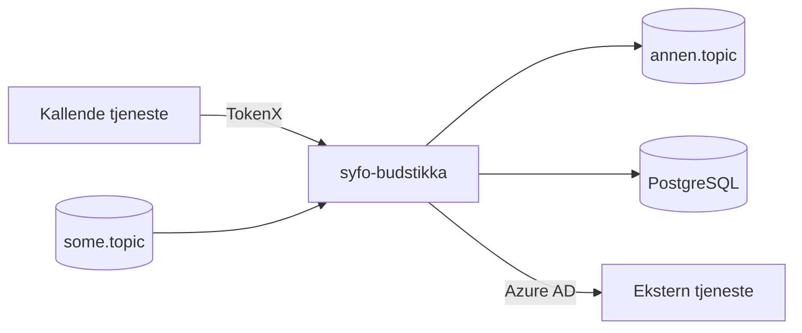

# README-oppdatering for dette Ktor-backend-repoet

Bruk denne skillen når README skal opprettes eller oppdateres. README skal speile det `no.nav.syfo`-backenden faktisk gjør i dag — ikke fylle ut en generisk mal og ikke beskrive ønsket fremtid.

Dette er et Ktor-backend-repo (Kotlin, Gradle, Netty, NAIS). Fokuser på det en backend-leser trenger: hva tjenesten gjør, hvilke API-er den eksponerer, hva den konsumerer/produserer på Kafka, hvilken database den eier, hvordan den autentiserer kallere, og hvordan andre tjenester når den. Dropp frontend-spesifikke grep (miljølenker for deploybar UI, mikrofront-tabeller, nav-dekoratør, Storybook).

## Steg 1: Les repoet først

Les faktiske kilder før du skriver én linje README:

1. **Eksisterende README** — bevar manuelt innhold, Slack-kanaler, wiki-lenker og stabile driftstips som fortsatt stemmer. Det genererte Ktor-scaffoldet (lenker til ktor.io, tom "Features"-tabell, `./gradlew run`-tabell) er ikke manuelt innhold — det skal erstattes.
2. **Stack og bygg** — `build.gradle.kts`, `settings.gradle.kts`, `gradle/libs.versions.toml`, `gradle.properties`. Hent `group` (`no.nav.syfo`), `mainClass` (typisk `io.ktor.server.netty.EngineMain`), JVM-toolchain, Ktor-versjon fra version catalog, og hvilke moduler som faktisk er på classpath (server-core, netty, auth, content-negotiation, flyway, kafka-klient, exposed/hikari osv.).
3. **NAIS-manifest** — `.nais/` (eller `nais/`, `.nais.yaml`) for miljøer (`dev-gcp`/`prod-gcp`), `ingresses`, `gcp.sqlInstances` (Postgres), `kafka`, `accessPolicy.inbound`/`outbound`, og `tokenx`/`azure`. Manifestet er fasiten for auth, integrasjoner og miljøer — ikke gjett.
4. **Kode** — `src/main/kotlin/` for Ktor-oppsett: `embeddedServer`/`Application.module()`, `routing { ... }`-blokker (endepunkter), `install(Authentication)` (TokenX/Azure AD-validering), Kafka consumer/producer, og databaselag. Sjekk `src/main/resources/application.yaml` (eller `.conf`) for porter, miljøvariabler og featuretoggles, og `src/main/resources/db/migration/` for Flyway-migrasjoner.
5. **CI/CD** — `.github/workflows/` for workflow-navn til CI-badge og deploy-flyt.
6. **Docs** — `docs/`, ADR-er og arkitektur-notater. Lenk i stedet for å duplisere lange forklaringer.

Avklar minst dette før du skriver:

- Hva er backendens hovedansvar, og hvilket domene dekker den?
- Hvilke miljøer finnes faktisk i `.nais/`?
- Hvilke REST/GraphQL-endepunkter eksponerer den, og hvilke krever auth?
- Konsumerer eller produserer den Kafka? Hvilke topics, og hvilken vei?
- Eier den en Postgres-database med Flyway-migrasjoner?
- Hvilke klienter kaller den (via TokenX eller Azure AD), og hvilke tjenester kaller den ut til (`accessPolicy.outbound`)?

## Steg 2: Velg relevante seksjoner

| Seksjon | Når | Hva du må hente fra repoet |
|---|---|---|
| Tittel + badges | Alltid | Repo-navn, workflow-navn, faktisk stack (Kotlin, Ktor, Gradle) samt linter/formatter/testverktøy (ktlint/spotless, JUnit/Kotest) |
| Formålet med repoet | Alltid | Se Formål-seksjonen |
| Mermaid-diagram | Hvis integrasjoner, auth eller flyt mellom tjenester | Faktiske flyter: kallende tjeneste → app (TokenX/Azure), Kafka inn/ut, Postgres, utgående API-kall. Se Mermaid-seksjonen |
| API-oversikt | Hvis repoet eksponerer API | Metode, sti, kort beskrivelse, auth-krav per endepunkt |
| Kafka | Hvis consumer/producer | Topics, retning (inn/ut), hva som leses/persisteres/publiseres videre |
| Database | Hvis Postgres/Flyway | Hva databasen eier, kort om sentrale tabeller, at skjema styres av Flyway-migrasjoner i `db/migration/` |
| Autentisering | Hvis `install(Authentication)` eller `tokenx`/`azure` i manifest | Hvilken mekanisme (TokenX, Azure AD), hvilke endepunkter som er beskyttet, hvem som er gyldige kallere (`accessPolicy.inbound`) |
| Utvikling | Alltid | Kort seksjon nederst: stabil lokal URL (typisk `http://localhost:8080`) og hvor leseren finner ferske kommandoer. Pek til `./gradlew tasks` i stedet for å liste konkrete `./gradlew test`/`build`/`run` |
| Les mer | Hvis docs finnes | Lenker til `docs/`, ADR-er og arkitektur |
| For Nav-ansatte | Alltid | Kontaktlenke til team-Slack som siste seksjon, pluss intern team-info. For team-esyfo er `[#esyfo på Slack](https://nav-it.slack.com/archives/C012X796B4L)` standard når ikke annet er kjent |

## Steg 3: Generer eller oppdater

### Ved oppdatering

- Behold seksjoner som fortsatt er riktige.
- Oppdater bare foreldet innhold; ikke skriv om alt uten grunn.
- Bevar manuelle detaljer som Slack-kanaler, wiki-lenker og driftstips hvis de fortsatt stemmer.
- Hvis eksisterende README har nyttige seksjoner som ikke finnes i denne skillen, behold dem når de gir verdi.
- Erstatt generert Ktor-scaffold-tekst (ktor.io-lenker, tom Features-tabell, generisk build/run-tabell) med innhold som beskriver det faktiske domenet.

### Tittelvalg

- Foreslå alltid 3 README-titler og spør brukeren før du låser tittelen.
- Alternativ 1: repo-navnet slik det er i dag (`syfo-budstikka`).
- Alternativ 2: et domenenært forslag basert på hva backenden faktisk gjør.
- Alternativ 3: et annet domenenært forslag med en annen vinkling (mer teknisk, eller mer rettet mot hva tjenesten leverer til konsumentene).
- Alternativ 4: brukeren skriver en egen tittel.
- Begrunn kort: app-navn i `syfo`-familien er ofte kryptiske, mens en domenenær tittel gjør README forståelig på sekunder for en ny leser.

### Ved ny README

- Inkluder alltid: tittel, badges, formål, diagram (eller en kort liste over integrasjoner hvis det er tydeligere) og utvikling.
- Ta kun med seksjoner backenden faktisk trenger.
- Bruk repoets egne navn på endepunkter, topics, databaser og miljøer.

### Kvalitetsregler

- Kognitiv trakt: tittel → formål/kontekst → API/Kafka/DB/auth → utvikling → meta. Lesere skanner ovenfra og ned.
- Ikke finn på endepunkter, topics, databaser, auth eller miljøer. Kryssjekk alltid mot kode og `.nais/`.
- Ikke påstå auth-oppsett uten å ha sett `install(Authentication)` i kode eller `tokenx`/`azure` i manifest.
- Hvis info mangler for en "alltid"-seksjon, bevar eksisterende tekst eller spør brukeren.
- I utviklingsseksjonen: pek til `./gradlew tasks` for tilgjengelige Gradle-oppgaver i stedet for å kopiere konkrete kommandoer. Da ser leseren alltid oppdatert liste.
- Skriv kort og konkret klarspråk i formål-, utviklings- og kontaktseksjonen. README er inngangsport, ikke komplett internwiki.

## Anti-mønstre å se etter

- Scaffold-rester: ktor.io-lenker, tom "Features"-tabell og generisk build/run-tabell fra Ktor Project Generator som aldri ble erstattet.
- Template cargo-culting: kopiert mal uten tilpasning til faktisk repo.
- Zombie sections: utdaterte seksjoner som aldri fjernes.
- Badge wall: mer enn 5 badges på rad uten tydelig signalverdi.
- README bloat: over 500 linjer — splitt heller innholdet i `docs/`.
- Command cargo-culting: kopierte `./gradlew`-kommandoer i stedet for å peke til `./gradlew tasks`.
- Stale examples: endepunkter, topics eller paths som ikke virker lenger.
- Aspirational docs: beskriver det som burde finnes, ikke det som finnes.
- Happy-path only: mangler feilhåndtering eller troubleshooting der det trengs.

## Badges

Bruk badges som speiler faktisk stack og workflows. CI-badge med repoets workflow-navn:

```md
[](https://github.com/navikt/<repo>/actions/workflows/<workflow>.yaml)
```

Legg til teknologi-badges for det stacken faktisk bruker (shields.io med logo). For dette repoet er det typisk Kotlin og Ktor; legg til linter/formatter (ktlint/spotless) og testverktøy (JUnit/Kotest) hvis de er i bruk. Ikke lag en komplett liste — ta bare med det repoet bruker.

## Mermaid-diagram

Tilpass diagrammet til backendens faktiske arkitektur, men velg format etter informasjonsbehov:

- **Bruk Mermaid** når README må forklare flyt mellom flere tjenester: kallende klient, app, Kafka, Postgres og utgående integrasjoner.
- **Bruk en kort punktliste i stedet** når avhengighetene er få og en liste er tydeligere.
- **Ikke ta med begge** uten tydelig grunn.

For en backend viser et godt diagram: hvilke klienter som kaller API-et (og om de bruker TokenX eller Azure AD), Kafka-topics inn og ut, PostgreSQL-databasen appen eier, og hvilke tjenester appen selv kaller ut til (`accessPolicy.outbound`).

```md

```

Bruk repoets faktiske topic-navn, tjenestenavn og auth-mekanismer — ikke plassholderne over.

## API-oversikt-seksjonen

Når backenden eksponerer et API, list endepunktene fra `routing { ... }` med metode, sti, kort beskrivelse og auth-krav:

```md
### API

| Metode | Sti | Beskrivelse | Auth |
|--------|-----|-------------|------|
| GET | `/api/v1/...` | Kort beskrivelse | TokenX |
| POST | `/api/v1/...` | Kort beskrivelse | Azure AD |
```

Ta bare med endepunkter som faktisk er sentrale for konsumentene. `/internal/is_alive`, `/internal/is_ready` og `/metrics` (NAIS-prober) trenger normalt ikke stå i API-tabellen.

## Formål-seksjonen

Formål skal forklare hva backenden gjør og for hvem:

- Hvilket domeneproblem løser tjenesten?
- Hvilke konsumenter (frontends, andre backender, jobber) er den til for?
- Hvis flere konsumenter bruker ulike deler av API-et, beskriv kort skillet.

## Database og Flyway

Hvis repoet eier en Postgres-database: beskriv kort hva databasen lagrer og hvilke sentrale tabeller som finnes, og slå fast at skjemaet styres av Flyway-migrasjoner i `src/main/resources/db/migration/`. Ikke dupliser hele skjemaet i README — pek til migrasjonsfilene som kilde.

## Observability

Hvis repoet har Grafana-dashboards, lenk til dem. Nav bruker `https://grafana.nav.cloud.nais.io/` med team-spesifikke dashboards. Sjekk `.nais/`-manifest eller eksisterende README for verifiserte dashboard-URL-er — ikke konstruer URL-er du ikke har sett.

## Grenser

### Alltid

- Les faktisk repo-innhold (`build.gradle.kts`, `.nais/`, `src/main/kotlin/`, `application.yaml`, workflows) før du skriver README.
- Kryssjekk README-tekst mot kode, manifest og workflows.
- Bevar manuelt innhold som fortsatt er riktig.
- Beskriv auth og integrasjoner med Nav-kontekst når de finnes: TokenX, Azure AD, `accessPolicy`, Kafka-topics, Postgres.

### Spør først

- Hvis du må gjette på miljølenker, Slack-kanal eller teamnavn.
- Hvis README mangler viktig produktkontekst som ikke kan utledes fra repoet.
- Hvis du vurderer å fjerne store manuelle seksjoner som kan være bevisst skrevet.

### Aldri

- Skriv en generisk README uten å lese repoet.
- Finn på API-er, topics, dashboards, auth eller miljøer.
- Overskriv manuelt innhold ukritisk.
- Dokumenter "ønsket fremtid" som om den allerede er implementert.
- Lær bort generell Markdown- eller Mermaid-syntaks i README-skillen.
