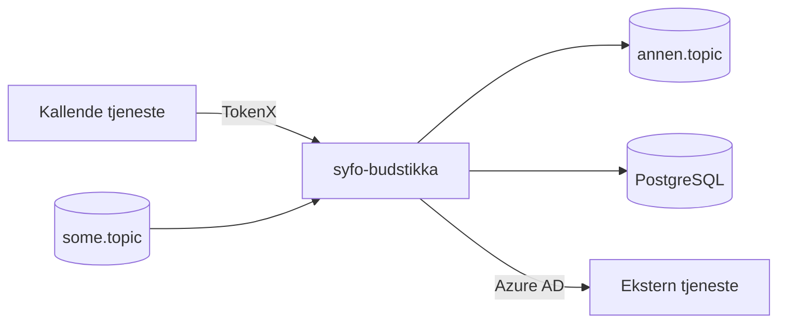

# README update

Use this skill when the README is to be created or updated. The README must mirror what the `no.nav.syfo` backend actually does today — not fill in a generic template and not describe a desired future.

Focus on what a backend reader needs: what the service does, which APIs it exposes, what it consumes/produces on Kafka, which database it owns, how it authenticates callers, and how other services reach it. Drop frontend-specific devices (environment links for a deployable UI, microfrontend tables, the Nav decorator, Storybook).

## Step 1: Read the repository first

Read the actual sources before writing a single line of README:

1. **Existing README** — preserve manual content, Slack channels, wiki links and stable operational tips that still hold. The generated Ktor scaffold (links to ktor.io, an empty "Features" table, the `./gradlew run` table) is not manual content — it must be replaced.
2. **Stack and build** — `build.gradle.kts`, `settings.gradle.kts`, `gradle/libs.versions.toml`, `gradle.properties`. Pull out `group` (`no.nav.syfo`), `mainClass` (typically `io.ktor.server.netty.EngineMain`), the JVM toolchain, the Ktor version from the version catalog, and which modules are actually on the classpath (server-core, netty, auth, content-negotiation, flyway, kafka client, exposed/hikari and so on).
3. **NAIS manifest** — `.nais/` (or `nais/`, `.nais.yaml`) for environments (`dev-gcp`/`prod-gcp`), `ingresses`, `gcp.sqlInstances` (Postgres), `kafka`, `accessPolicy.inbound`/`outbound`, and `tokenx`/`azure`. The manifest is the source of truth for auth, integrations and environments — do not guess.
4. **Code** — `src/main/kotlin/` for the Ktor setup: `embeddedServer`/`Application.module()`, `routing { ... }` blocks (endpoints), `install(Authentication)` (TokenX/Azure AD validation), Kafka consumer/producer, and the database layer. Check `src/main/resources/application.yaml` (or `.conf`) for ports, environment variables and feature toggles, and `src/main/resources/db/migration/` for Flyway migrations.
5. **CI/CD** — `.github/workflows/` for the workflow name used in the CI badge and the deploy flow.
6. **Docs** — maintained contracts and reader/operator documentation. Link
   only to what a README reader needs; do not build an ADR catalogue. Follow
   `docs/agents/domain.md` for targeted document links.

Clarify at least this before you write:

- What is the backend's main responsibility, and which domain does it cover?
- Which environments actually exist in `.nais/`?
- Which REST/GraphQL endpoints does it expose, and which of them require auth?
- Does it consume or produce on Kafka? Which topics, and in which direction?
- Does it own a Postgres database with Flyway migrations?
- Which clients call it (via TokenX or Azure AD), and which services does it call out to (`accessPolicy.outbound`)?

## Step 2: Pick the relevant sections

| Section | When | What you must pull from the repository |
|---|---|---|
| Tittel + badges | Always | Repository name, workflow name, actual stack (Kotlin, Ktor, Gradle) plus linter/formatter/test tooling (ktlint/spotless, JUnit/Kotest) |
| Formålet med repoet | Always | See the Formål section |
| Mermaid-diagram | If there are integrations, auth or flow between services | The actual flows: calling service → app (TokenX/Azure), Kafka in/out, Postgres, outgoing API calls. See the Mermaid section |
| API-oversikt | If the repository exposes an API | Method, path, short description, auth requirement per endpoint |
| Kafka | If consumer/producer | Topics, direction (in/out), what is read/persisted/published onward |
| Database | If Postgres/Flyway | What the database owns, briefly about the central tables, that the schema is governed by Flyway migrations in `db/migration/` |
| Autentisering | If `install(Authentication)` or `tokenx`/`azure` in the manifest | Which mechanism (TokenX, Azure AD), which endpoints are protected, who counts as a valid caller (`accessPolicy.inbound`) |
| Utvikling | Always | Short section at the bottom: a stable local URL (typically `http://localhost:8080`) and where the reader finds fresh commands. Point to `./gradlew tasks` instead of listing specific `./gradlew test`/`build`/`run` |
| Les mer | If docs exist | Links to the maintained topic and operator documents the reader needs |
| For Nav-ansatte | Always | A contact link to the team Slack as the last section, plus internal team info. For team-esyfo, `[#esyfo på Slack](https://nav-it.slack.com/archives/C012X796B4L)` is the default when nothing else is known |

## Step 3: Generate or update

### When updating

- Keep sections that are still correct.
- Update only outdated content; do not rewrite everything without reason.
- Preserve manual details such as Slack channels, wiki links and operational tips if they still hold.
- If the existing README has useful sections that this skill does not list, keep them when they add value.
- Replace generated Ktor scaffold text (ktor.io links, empty Features table, generic build/run table) with content that describes the actual domain.

### Choosing a title

- Always propose 3 README titles and ask the user before locking the title in.
- Option 1: the repository name as it stands today (`syfo-budstikka`).
- Option 2: a domain-oriented suggestion based on what the backend actually does.
- Option 3: another domain-oriented suggestion with a different angle (more technical, or more focused on what the service delivers to its consumers).
- Option 4: the user writes their own title.
- Justify briefly: app names in the `syfo` family are often cryptic, while a domain-oriented title makes the README understandable in seconds for a new reader.

### For a new README

- Always include: title, badges, purpose, diagram (or a short list of integrations if that is clearer) and development.
- Include only the sections the backend actually needs.
- Use the repository's own names for endpoints, topics, databases and environments.

### Quality rules

- Cognitive funnel: title → purpose/context → API/Kafka/DB/auth → development → meta. Readers scan from the top down.
- Do not invent endpoints, topics, databases, auth or environments. Always cross-check against the code and `.nais/`.
- Do not claim an auth setup without having seen `install(Authentication)` in the code or `tokenx`/`azure` in the manifest.
- If information is missing for an "always" section, preserve the existing text or ask the user.
- In the development section: point to `./gradlew tasks` for the available Gradle tasks instead of copying specific commands. That way the reader always sees an up-to-date list.
- Write short, concrete plain language in the purpose, development and contact sections. The README is an entry point, not a complete internal wiki.

## Anti-patterns to watch for

- Scaffold leftovers: ktor.io links, an empty "Features" table and the generic build/run table from the Ktor Project Generator that were never replaced.
- Template cargo-culting: a copied template with no adaptation to the actual repository.
- Zombie sections: outdated sections that are never removed.
- Badge wall: more than 5 badges in a row with no clear signal value.
- README bloat: over 500 lines — split the content into `docs/` instead.
- Command cargo-culting: copied `./gradlew` commands instead of pointing to `./gradlew tasks`.
- Stale examples: endpoints, topics or paths that no longer work.
- Aspirational docs: describing what ought to exist, not what does exist.
- Happy-path only: missing error handling or troubleshooting where it is needed.

## Badges

Use badges that mirror the actual stack and workflows. A CI badge with the repository's workflow name:

```md
[](https://github.com/navikt/<repo>/actions/workflows/<workflow>.yaml)
```

Add technology badges for what the stack actually uses (shields.io with logo). In this repository that is typically Kotlin and Ktor; add linter/formatter (ktlint/spotless) and test tooling (JUnit/Kotest) if they are in use. Do not build an exhaustive list — include only what the repository uses.

## Mermaid diagram

Adapt the diagram to the backend's actual architecture, but choose the format according to the information need:

- **Use Mermaid** when the README needs to explain flow between several services: calling client, app, Kafka, Postgres and outgoing integrations.
- **Use a short bullet list instead** when the dependencies are few and a list is clearer.
- **Do not include both** without a clear reason.

For a backend, a good diagram shows: which clients call the API (and whether they use TokenX or Azure AD), Kafka topics in and out, the PostgreSQL database the app owns, and which services the app itself calls out to (`accessPolicy.outbound`).

```md

```mermaid
flowchart LR
    klient[Kallende tjeneste] -->|TokenX| app[syfo-budstikka]
    topicInn[(some.topic)] --> app
    app --> topicUt[(annen.topic)]
    app --> db[(PostgreSQL)]
    app -->|Azure AD| ekstern[Ekstern tjeneste]
```
```

Use the repository's actual topic names, service names and auth mechanisms — not the placeholders above.

## The API-oversikt section

When the backend exposes an API, list the endpoints from `routing { ... }` with method, path, a short description and the auth requirement:

```md
### API

| Metode | Sti | Beskrivelse | Auth |
|--------|-----|-------------|------|
| GET | `/api/v1/...` | Kort beskrivelse | TokenX |
| POST | `/api/v1/...` | Kort beskrivelse | Azure AD |
```

Include only endpoints that are actually central to the consumers. `/internal/isalive`, `/internal/isready` and `/metrics` (NAIS probes) normally do not need to appear in the API table.

## The Formål section

Formål must explain what the backend does and for whom:

- Which domain problem does the service solve?
- Which consumers (frontends, other backends, jobs) is it for?
- If several consumers use different parts of the API, describe the distinction briefly.

## Database and Flyway

If the repository owns a Postgres database: describe briefly what the database stores and which central tables exist, and state that the schema is governed by Flyway migrations in `src/main/resources/db/migration/`. Do not duplicate the entire schema in the README — point to the migration files as the source.

## Observability

If the repository has Grafana dashboards, link to them. Nav uses `https://grafana.nav.cloud.nais.io/` with team-specific dashboards. Check the `.nais/` manifest or the existing README for verified dashboard URLs — do not construct URLs you have not seen.

## Boundaries

### Always

- Read actual repository content (`build.gradle.kts`, `.nais/`, `src/main/kotlin/`, `application.yaml`, workflows) before you write the README.
- Cross-check the README text against code, manifest and workflows.
- Preserve manual content that is still correct.
- Describe auth and integrations with Nav context where they exist: TokenX, Azure AD, `accessPolicy`, Kafka topics, Postgres.

### Ask first

- If you would have to guess environment links, Slack channel or team name.
- If the README lacks important product context that cannot be derived from the repository.
- If you are considering removing large manual sections that may have been written deliberately.

### Never

- Write a generic README without reading the repository.
- Invent APIs, topics, dashboards, auth or environments.
- Overwrite manual content indiscriminately.
- Document a "desired future" as if it were already implemented.
- Teach general Markdown or Mermaid syntax in the README skill.
