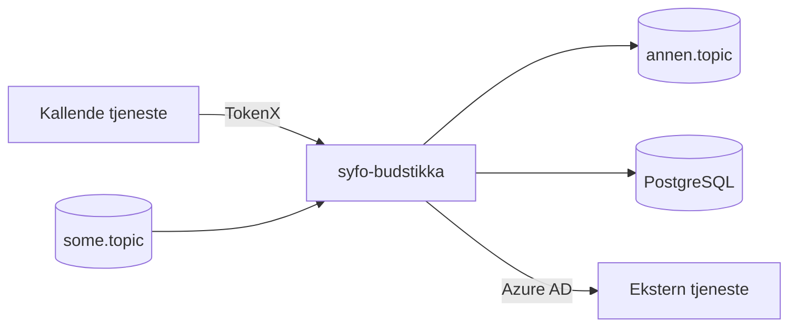

# Section templates for badges, Mermaid diagrams, and API tables

Templates and rules for the heaviest README sections. Read this only when writing
the relevant section; see `content-catalog.md`.

## Badges

Use badges that reflect the actual stack and workflows. Use the repository
workflow name in the CI badge:

```md
[](https://github.com/navikt/<repo>/actions/workflows/<workflow>.yaml)
```

Add technology badges only for the stack actually in use (shields.io with logo).
For this repository that is typically Kotlin and Ktor; add lint/formatting
(ktlint/spotless) and test tools (JUnit/Kotest) only when used. Do not make a
complete inventory.

## Mermaid diagram

Adapt the diagram to the backend's actual architecture, choosing its format from
the information need:

- **Use Mermaid** when the README must explain a flow across several services:
  caller, app, Kafka, PostgreSQL, and outgoing integrations.
- **Use a short list instead** when dependencies are few and a list is clearer.
- **Do not include both** without a clear reason.

For a backend, show calling clients (and whether they use TokenX or Azure AD),
Kafka topics in and out, the PostgreSQL database owned by the app, and services
the app calls through `accessPolicy.outbound`.

```md

```

Use actual repository topic names, service names, and auth mechanisms — not the
placeholders above.

## API overview section

When the backend exposes an API, list endpoints from `routing { ... }` with
method, path, short description, and auth requirement:

```md
### API

| Metode | Sti | Beskrivelse | Auth |
|--------|-----|-------------|------|
| GET | `/api/v1/...` | Kort beskrivelse | TokenX |
| POST | `/api/v1/...` | Kort beskrivelse | Azure AD |
```

Include only endpoints central to consumers. `/internal/health/is_alive`,
`/internal/health/is_ready`, and `/internal/metrics` normally do not belong in
the API table.
