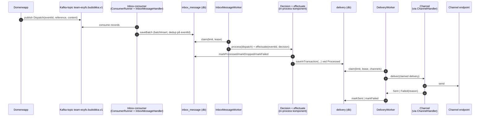

# Budstikka

## Formål

Budstikka er en Ktor-backend for å håndtere kommunikasjon fra våre apper til flere eksterne og interne kanaler.

## Big picture

## Beslutningsmønster

Beslutningsmotoren er en in-process komponent som kalles fra `InboxMessageWorker`, ikke en egen worker/task. Figuren viser den som én boks (`Decision + effectuate`) for å holde hovedflyten enkel.

I kode er den delt i `DecisionProcess` og `EffectuateDecision`, og kjører i to steg:

1. `DecisionRule.resolve(event)` henter grunnlag i parallell.
2. `ResolvedRule.apply(deliveries)` foldes sekvensielt, med short-circuit ved `Dropped`/`Failed`.

Dette gir lavere ventetid på oppslag og samtidig forutsigbar regelrekkefølge.

## Arkitekturoversikt

Se [overordnet flyt](docs/flyt.md) for claim/lease, batch insert, kanal-mapping og flere detaljer.

## For Nav-ansatte

Spørsmål om tjenesten kan tas i [#esyfo på Slack](https://nav-it.slack.com/archives/C012X796B4L).
