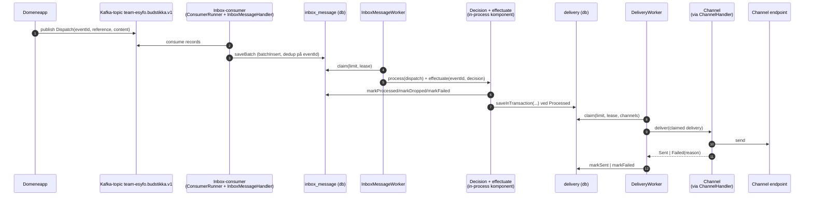

# Budstikka

[](https://kotlinlang.org/)
[](https://ktor.io/)
[](https://www.postgresql.org/)
[](https://gradle.org/)
[](https://openjdk.org/)

## Formål

Budstikka er en Ktor-backend for å håndtere kommunikasjon fra våre apper til flere eksterne og interne kanaler.

## Big picture



## Beslutningsmønster

Beslutningsmotoren er en in-process komponent som kalles fra `InboxMessageWorker`, ikke en egen worker/task. Figuren viser den som én boks (`Decision + effectuate`) for å holde hovedflyten enkel.

I kode er den delt i `DecisionProcess` og `EffectuateDecision`, og kjører i to steg:

1. `DecisionRule.resolve(event)` henter grunnlag i parallell.
2. `ResolvedRule.apply(deliveries)` foldes sekvensielt, med short-circuit ved `Dropped`/`Failed`.

Dette gir lavere ventetid på oppslag og samtidig forutsigbar regelrekkefølge.

## Arkitekturoversikt

Se [overordnet flyt](docs/flyt.md) for claim/lease, batch insert, kanal-mapping og flere detaljer.

## Kjøre lokalt

Forutsetninger: [mise](https://mise.jdx.dev/) og en container-runtime (Docker eller podman) som kjører. `mise` gir deg riktig Java-versjon og oppgavene under.

Det finnes to måter å kjøre appen lokalt på.

### Testcontainers (enklest, uten compose)

```sh
mise dev:tc       # eller: ./gradlew runLocal
```

Dette booter hele appen mot Testcontainers: Postgres og Kafka startes fra kode, eksterne integrasjoner (for eksempel PDL) byttes mot fakes, og en Kafka UI startes i nettleseren for å inspisere topics, meldinger, konsumentgrupper og offsets. Ved oppstart logges Kafka-bootstrap, formidling-topic, JDBC-URL og Kafka UI-URL for live-inspeksjon. Avslutt med Ctrl+C, som river ned containerne.

Løpet trenger ikke docker-compose-infraen og henter ikke tokens. Det bruker samme test-substrat som e2e-testene. Se `docs/TESTSTRATEGI.md` for detaljer.

Loggene i det lokale løpet er menneskelig lesbar tekst (ikke JSON) via `src/test/resources/logback-local.xml`. Prod logger fortsatt strukturert JSON.

### Docker-compose (ekte adaptere)

```sh
mise run go           # starter infra + kjører appen (./gradlew run)
mise run infra        # starter bare Postgres + Kafka + Kafka UI
mise run infra:down   # stopper infraen
```

`mise run go` kjører appen mot compose-infraen med de ekte adapterne. Miljøvariablene (DB, Kafka) leses fra `mise.toml`.

### IntelliJ

1. Åpne prosjektet som et Gradle-prosjekt og sett prosjekt-JDK til Java 25.
2. For Testcontainers-løpet: kjør Gradle-oppgaven `runLocal` (under `application` i Gradle-vinduet), eller åpne `src/test/kotlin/no/nav/budstikka/LocalApp.kt` og kjør `main()` direkte fra kjør-knappen i margen. Dette løpet er selvstendig og trenger ingen miljøvariabler.
3. For compose-løpet: start infraen med `mise run infra` først, og kjør deretter Gradle-oppgaven `run`. Sett da miljøvariablene fra `mise.toml` i kjørekonfigurasjonen (IntelliJ leser dem ikke automatisk fra mise).

## Testing

```sh
mise run test         # enhets- og integrasjonstester (rask, e2e ekskludert)
mise run test:e2e     # opt-in full-boot e2e mot Testcontainers
mise run lint         # ktlintCheck
```

E2e-testene er tagget `E2E` og kobles ikke til `test` eller `build`, så deploy-løpet slipper å vente på dem. Kjør dem lokalt eller i en egen jobb ved behov.

## For Nav-ansatte

Spørsmål om tjenesten kan tas i [#esyfo på Slack](https://nav-it.slack.com/archives/C012X796B4L).
