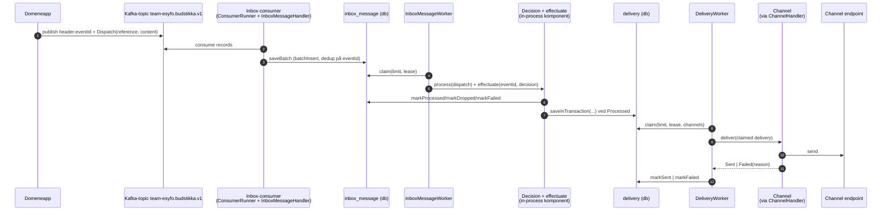

# Budstikka – send varsler fra sykefraværsappene

[](https://kotlinlang.org/)
[](https://ktor.io/)
[](https://www.postgresql.org/)
[](https://gradle.org/)
[](https://openjdk.org/)

Budstikka gir sykefraværsappene en felles Kafka-kontrakt for å sende varsler. Appen bygger en
ferdig `EncodedDispatch` med fasaden og publiserer den med sin egen Kafka-producer.

## Slik sender du varsel

Legg Nav sitt GitHub Packages-speil og kontrakten i produsentens Gradle-bygg. Kontrakten inneholder
ikke `kafka-clients`; appen eier selv Kafka-versjon, producer-konfigurasjon og livsløp.

```kotlin
repositories {
    maven("https://github-package-registry-mirror.gc.nav.no/cached/maven-release")
    mavenCentral()
}

dependencies {
    implementation("no.nav.syfo:budstikka-kontrakt:0.1.0")
    implementation("org.apache.kafka:kafka-clients:4.3.1")
}
```

Produsenten trenger minst Kotlin 2.3 og Java 21, samt Kafka-tilgang. [Producerguiden](docs/sende-varsler.md)
beskriver påkrevd `kafka.pool` og `write` ACL.

Opprett og lagre `EventId` sammen med eget arbeid **før** første sending. Ved retry eller recovery
leser du den lagrede id-en og bruker den på nytt. Opprettelsen må være atomisk; en vanlig
load-then-create-sekvens er ikke nok når flere workers kan behandle samme arbeid.

```kotlin
import no.nav.budstikka.contract.Budstikka
import no.nav.budstikka.contract.EventId
import no.nav.budstikka.contract.PersonIdentifier
import no.nav.budstikka.contract.Varseltype
import org.apache.kafka.clients.producer.ProducerRecord

// Pseudokode: opprett og lagre EventId atomisk i egen lagring, og les samme id ved retry.
val eventId = eventIdStore.loadOrCreateAtomically(notificationId) { EventId.new() }

val encoded = Budstikka.brukervarselCreate(
    eventId = eventId,
    reference = "synthetic-reference-0001",
    sykmeldt = PersonIdentifier("00000000000"),
    varseltype = Varseltype.BESKJED,
    text = "SYNTETISK-VARSELTEKST",
)

val record = ProducerRecord(encoded.topic, encoded.key, encoded.value)
encoded.headerBytes().forEach { (name, value) -> record.headers().add(name, value) }
kafkaProducer.send(record)
```

`encoded.key` er mottakerens partisjonsnøkkel. `eventId` ligger bare i headeren og brukes til
deduplisering. Ikke logg nøkkel, payload eller varseltekst.

Se [producerguiden](docs/sende-varsler.md) for støttede funksjoner, retry og versjonering.

## Arkitektur


```mermaid
sequenceDiagram
    autonumber
    participant producer as Domeneapp
    participant kafka as Kafka-topic team-esyfo.budstikka.v1
    participant consumer as Inbox-consumer<br/>(ConsumerRunner + InboxMessageHandler)
    participant inbox as inbox_message (db)
    participant iworker as InboxMessageWorker
    participant decision as Decision + effectuate<br/>(in-process komponent)
    participant delivery as delivery (db)
    participant dworker as DeliveryWorker
    participant channel as Channel<br/>(via ChannelHandler)
    participant target as Channel endpoint

    producer->>kafka: publish header:eventId + Dispatch(reference, content)
    consumer->>kafka: consume records
    consumer->>inbox: saveBatch (batchInsert, dedup på eventId)
    iworker->>inbox: claim(limit, lease)
    iworker->>decision: process(dispatch) + effectuate(eventId, decision)
    decision->>inbox: markProcessed/markDropped/markFailed
    decision->>delivery: saveInTransaction(...) ved Processed
    dworker->>delivery: claim(limit, lease, channels)
    dworker->>channel: deliver(claimed delivery)
    channel->>target: send
    channel-->>dworker: Sent | Failed(reason)
    dworker->>delivery: markSent | markFailed
```

Budstikka konsumerer kontrakten fra Kafka, lagrer meldingen og sender den videre til riktig kanal.
Den interne flyten eies av [docs/flyt.md](docs/flyt.md).

Øvrig vedlikeholdt dokumentasjon:

- [Datamodell](docs/datamodell.md) — inbox, delivery, dead letter, claim/lease og tilstander
- [Migrering](docs/migrering.md) — kildefestet cutover-plan fra esyfovarsel
- [Kanalkart esyfovarsel](docs/esyfovarsel-kanalkart.md) — kildefestet kanalinventar og dokdist-detaljer
- [Teststrategi](docs/teststrategi.md) — delt testsubstrat, e2e og lokal kjøring
- [Helsesjekk](docs/helsesjekk.md) — liveness-kontrakten for Kafka-consumeren
- [Dead-letter-replay](docs/dead-letter-replay.md) — manuell replay-prosedyre
- [Ordliste](docs/glossary.md) — eier domenevokabularet

## Kjøre lokalt

Forutsetninger: [mise](https://mise.jdx.dev/) og en container-runtime (Docker eller podman).

```sh
mise dev:tc       # eller: ./gradlew runLocal
```

Løpet starter appen mot Testcontainers med Postgres, Kafka og fakes for eksterne integrasjoner.
Se [teststrategien](docs/teststrategi.md) for testnivåer og lokal kjøring. Kjør `./gradlew tasks`
for tilgjengelige Gradle-oppgaver.

## Agentoppsett

Repoet er testbenk for Grillmester-agentoppsettet for GitHub Copilot CLI.
[.github/GRILLMESTER.md](.github/GRILLMESTER.md) er kartet over agenter, skills og
instruksjoner. `mise lint:agents` kjører de deterministiske agent-gatene lokalt.
Aktiver pre-commit-vakten mot PII i stagede filer én gang per klon:

```sh
git config core.hooksPath .githooks
```

## For Nav-ansatte

Spørsmål om tjenesten kan tas i [#esyfo på Slack](https://nav-it.slack.com/archives/C012X796B4L).
