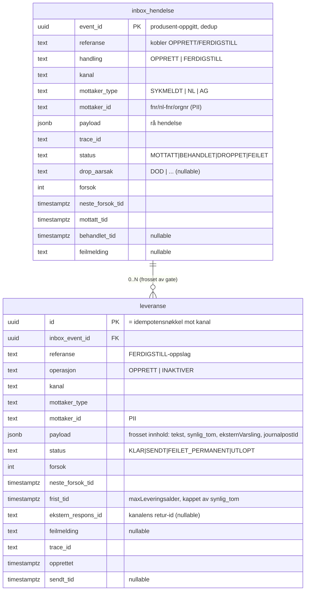

# Datamodell — syfo-budstikka

Avledet av B1–B18. To tabeller: **`inbox_hendelse`** (transport + dedup + beslutning)
og **`leveranse`** (outbox: frosne konkrete utsendinger). Postgres. Topologi A
(jf. B13) — kan utvides til varsel-aggregat senere (additiv migrering).



## Tilstandsmaskiner

### inbox_hendelse.status
```
MOTTATT ──(gate ok, skriv leveranser)──▶ BEHANDLET   (terminal)
MOTTATT ──(død via PDL)───────────────▶ DROPPET      (terminal, drop_aarsak=DOD)
MOTTATT ──(transient: PDL/KRR nede)───▶ MOTTATT      (forsok++, neste_forsok_tid backoff)
MOTTATT ──(permanent: ugyldig payload)▶ FEILET       (terminal, alert)
```
Settes utelukkende av **beslutnings-workeren**, i samme DB-tx som skriver leveranse(r)
eller dropper. Konsument skriver kun `MOTTATT`.

### leveranse.status
```
KLAR ──(sendt ok)────────────────▶ SENDT             (terminal)
KLAR ──(transient feil)──────────▶ KLAR              (forsok++, neste_forsok_tid backoff)
KLAR ──(permanent feil, 4xx)─────▶ FEILET_PERMANENT  (terminal, alert)
KLAR ──(frist_tid/synlig_tom)────▶ UTLOPT            (terminal, alert)
KLAR ──(FERDIGSTILL før sending)─▶ KANSELLERT        (terminal, jf. B20)
```
Transient feil er ikke egen status — raden blir i `KLAR` med backoff. Aldri stille dropp.
`KANSELLERT` settes når en FERDIGSTILL treffer en ennå-`KLAR` OPPRETT (lokal annullering,
ingen utsending + lukking). En INAKTIVER-leveranse er en egen rad (`operasjon=INAKTIVER`)
som går gjennom samme KLAR→SENDT-løp.

## Workere (polling, radlås)
- **Beslutnings-worker:** `SELECT … FROM inbox_hendelse WHERE status='MOTTATT'
  AND neste_forsok_tid <= now() FOR UPDATE SKIP LOCKED`. Eksterne lesekall (PDL/KRR)
  først, så én tx: oppdater inbox + insert leveranse(r).
- **Outbox-worker:** `SELECT … FROM leveranse WHERE status='KLAR'
  AND neste_forsok_tid <= now() FOR UPDATE SKIP LOCKED`. Holder radlås under sending
  (B15), stramme klient-timeouts. Idempotensnøkkel = `leveranse.id` (B16).

## Indekser
- `inbox_hendelse`: PK(`event_id`); idx(`status`,`neste_forsok_tid`) for plukk.
- `leveranse`: PK(`id`); idx(`status`,`neste_forsok_tid`) for plukk;
  idx(`referanse`,`mottaker_id`,`kanal`) for FERDIGSTILL-oppslag; idx(`inbox_event_id`).

## Observability-koblinger (jf. B17)
- `trace_id` på begge tabeller; strukturert logg ved hver overgang med
  `leveranse_id`/`referanse`/`kanal`/`status`/`trace_id`.
- Prometheus-metrikker kun lav kardinalitet (`kanal`,`status`,`mottaker_type`,`feiltype`).
  Drill-down til enkelt-id via Loki/Tempo, ikke metrikk-labels.

## Åpne punkter
- Retensjon/sletting av PII (fnr) — GDPR. Eget designpunkt.
- FERDIGSTILL-flyt i detalj (matching, hvilke kanaler kan lukkes) — område 2.
- `payload`-skjema pr. kanal (typet DTO ↔ jsonb) — kanal-DTO-område (3).
