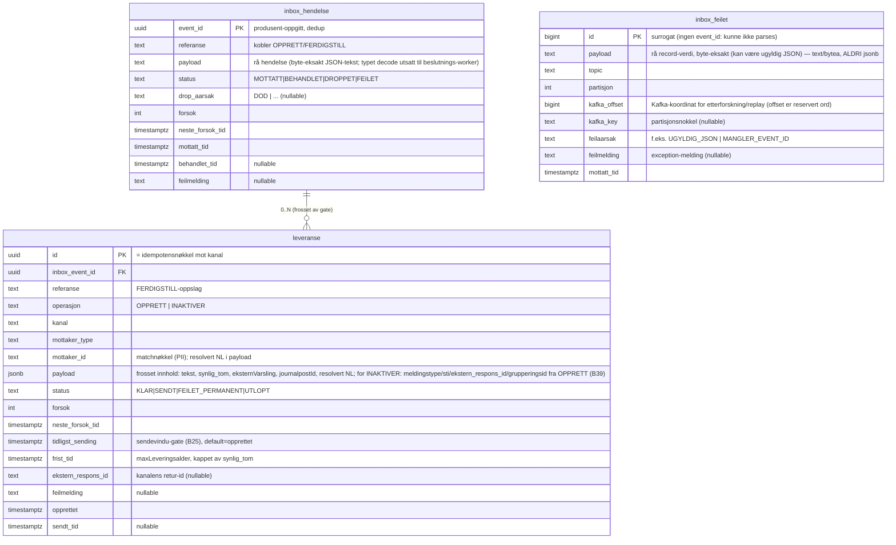

# Datamodell — syfo-budstikka

Avledet av B1–B18. Tre tabeller: **`inbox_hendelse`** (transport + dedup + beslutning),
**`leveranse`** (outbox: frosne konkrete utsendinger) og **`inbox_feilet`** (dead-letter:
meldinger konsumenten ikke klarte å parse). Postgres. Topologi A (jf. B13) — kan utvides
til varsel-aggregat senere (additiv migrering).



## Konsument: rå dump (envelope-only parse)
Konsumenten skriver **kun** til `inbox_hendelse` og gjør ingen typet decode. `eventId`
og `referanse` ligger i konvolutten (`Formidling`, jf. `KONTRAKT.md`) og hentes ut med en
strukturell JSON-lesing (`Json.parseToJsonElement`) — ikke via domenetyper. Kafka-nøkkelen
er `partisjonsnokkel` (partisjonering/rekkefølge, B5), ikke dedup-nøkkel, så `event_id`
må leses fra payloaden. Selve payloaden lagres byte-eksakt som `text`.

Den sealed `innhold`-delen (mottaker, operasjon/`handling`, `kanal`, tekst, ekstern
varsling) dekodes først av **beslutnings-workeren**. Derfor bor `handling`, `kanal`,
`mottaker_type` og `mottaker_id` ikke på `inbox_hendelse`: de utledes ved behandling og
fryses på `leveranse`. Dedup skjer på `event_id` (PK) via `INSERT … ON CONFLICT DO NOTHING`.

Malformet JSON (klarer ikke å hente `event_id`) er en konsument-grense-feil (sjelden;
tiltrodd produsent + typet kontraktlib) → dead-letter til `inbox_feilet`, ikke stille dropp.
Gyldig konvolutt med ugyldig `innhold` lagres som `MOTTATT` og går til `FEILET` når workeren
dekoder — jf. tilstandsmaskinen under.

### Vurdert: `event_id` som obligatorisk Kafka-header
Åpent for vurdering under implementering (#19). I dag henter konsumenten `event_id` fra
payloaden via strukturell JSON-lesing. Alternativet er å kreve `event_id` som Kafka-header,
slik at konsumenten ikke parser bodyen ved mottak.

Gevinst: konsumenten blir en ekte null-parse dump. `UGYLDIG_JSON`-triggeren ved ingest
forsvinner, og dedup (`ON CONFLICT`, B4) overlever selv om body-skjemaet endrer seg eller er
midlertidig ugyldig, fordi dedup løsrives fra payload-skjemaet.

Dette fjerner ikke `inbox_feilet`, det krymper bare triggeren. Hold to feilflater fra hverandre:

- **Ingen gyldig `event_id`** (header mangler eller er korrupt) → ingen PK å inserte på →
  fortsatt `inbox_feilet` (`MANGLER_EVENT_ID`). En header kan ikke håndheves av broker;
  «obligatorisk» er en kontrakt, ikke en garanti, og en produsent-bug kan utelate den.
- **Konvolutt OK, `innhold` dekoder ikke** hos beslutnings-workeren →
  `inbox_hendelse.status=FEILET`, ikke `inbox_feilet`. Denne decoden er allerede utsatt til
  workeren by design, så utsatt deserialisering endrer ingenting her.

`inbox_feilet` kan først fjernes helt hvis inbox-PK byttes fra `event_id` til et
surrogat/Kafka-koordinat og `event_id` blir en nullable unik dedup-kolonne. Da ingester hver
record, og poison blir bare en status. Kostnaden er at den rene B4-idempotensen (`event_id`
PK + `ON CONFLICT DO NOTHING`) ryker, og at mulig-ugyldige bytes havner i
hoved-operasjonstabellen i stedet for i `inbox_feilet` (`text`/`bytea`, aldri `jsonb`).

Anbefaling: vurder header-varianten i #19 for å løsrive dedup fra payload-skjemaet, men
behold `inbox_feilet` for record uten gyldig `event_id`.

## Feiltaksonomi ved konsument-grensen (best practice)
Bransjestandard (Confluent/Spring Kafka): **klassifiser feilen, rut på klasse.** Konsumenten
har kun to feilklasser, og de rutes ulikt:

| Feilklasse | Eksempel | Håndtering | Hvorfor |
|---|---|---|---|
| **Transient** | inbox-DB nede | Handler **kaster** → `ConsumerRunner` committer ikke, bygger consumer på nytt og re-poller samme batch med backoff (blokker-og-prøv-igjen) | Selv-helende; ingen tap. DB kommer tilbake. |
| **Poison** | ugyldig JSON, mangler `event_id` | Handler dead-letter til `inbox_feilet`, **returnerer normalt** → offset committes, partisjon flyter videre | Deterministisk feil; retry gir identisk feil. Unngår head-of-line-blokkering; meldingen er bevart. |

Konsekvenser og bevisste valg:

- **Ingen Kafka retry-topic.** Klassisk retry-topic håndterer *nedstrøms* transiente feil
  (PDL/KRR/DB) — de retryes hos **beslutnings-workeren** av inboxen (`MOTTATT` +
  `neste_forsok_tid` backoff), ikke ved re-konsum fra Kafka. Ved konsument-grensen finnes
  bare de to klassene over.
- **Poison retryes ikke N ganger** før dead-letter: en deterministisk feil feiler likt hver
  gang, så den dead-letteres umiddelbart.
- **Dead-letter i Postgres-tabell, ikke DLQ-topic.** Gjenbruker DB + hard-delete-retensjon;
  SQL til inspeksjon/replay; slipper egen Kafkarator-topic + separat konsument.
- **`inbox_feilet.payload` er `text`/`bytea`, ALDRI `jsonb`.** Tabellen finnes nettopp for å
  bevare mulig-ugyldige bytes; `jsonb` ville avvist radene den skal ta vare på.
- **Liveness ser ikke en poison-stall.** Ved transient blokkering lykkes `poll()` (heartbeat
  grønn), så en blokkert partisjon fanges av **consumer-lag-alert**, ikke liveness-proben
  (jf. `HELSESJEKK.md`). Lag-alert er derfor påkrevd.
- **Idempotens + backoff** finnes allerede: `event_id` PK (`ON CONFLICT DO NOTHING`) og
  eksponentiell backoff i `ConsumerRunner`.

`ConsumerRunner` forblir domeneblind: «handler kastet ⇒ transient ⇒ blokker og prøv igjen».
Poison-klassifiseringen bor i `InboxHandler`, der domenekunnskapen er. **Implementeres i egen
PR.**

## Tilstandsmaskiner

### inbox_hendelse.status
```
MOTTATT ──(gate ok, skriv leveranser)──▶ BEHANDLET   (terminal)
MOTTATT ──(død via PDL)───────────────▶ DROPPET      (terminal, drop_aarsak=DOD)
MOTTATT ──(transient: PDL/KRR nede)───▶ MOTTATT      (forsok++, neste_forsok_tid backoff)
MOTTATT ──(permanent: ugyldig payload)▶ FEILET       (terminal, alert)
```
Settes utelukkende av **beslutnings-workeren**, i samme DB-tx som skriver leveranse(r)
eller dropper. Konsument skriver kun `MOTTATT`.

### leveranse.status
```
KLAR ──(sendt ok)────────────────▶ SENDT             (terminal)
KLAR ──(transient feil)──────────▶ KLAR              (forsok++, neste_forsok_tid backoff)
KLAR ──(permanent feil, 4xx)─────▶ FEILET_PERMANENT  (terminal, alert)
KLAR ──(frist_tid/synlig_tom)────▶ UTLOPT            (terminal, alert)
KLAR ──(FERDIGSTILL før sending)─▶ KANSELLERT        (terminal, jf. B20)
```
Transient feil er ikke egen status — raden blir i `KLAR` med backoff. Aldri stille dropp.
`KANSELLERT` settes når en FERDIGSTILL treffer en ennå-`KLAR` OPPRETT (lokal annullering,
ingen utsending + lukking). En INAKTIVER-leveranse er en egen rad (`operasjon=INAKTIVER`)
som går gjennom samme KLAR→SENDT-løp.

## Workere (polling, radlås)
Topologi: én generisk dyp modul + tynn `Kanalhandler`-seam (dispatch på `kanal`), jf.
B27. Generisk maskineri (poll, radlås, retry/backoff, status, tracing, metrikker) bor
ÉN gang; kanalspesifikt bak smalt grensesnitt.

- **Beslutnings-worker** (functional core / imperative shell, B28):
  `SELECT … FROM inbox_hendelse WHERE status='MOTTATT' AND neste_forsok_tid <= now()
  FOR UPDATE SKIP LOCKED`. Tre steg: (1) `Grunnlagsinnhenter` henter PDL/KRR/NL (I/O,
  betinget på hendelsestype) → immutabelt `Beslutningsgrunnlag`; (2) `decide(hendelse,
  grunnlag): Beslutning` — REN funksjon, all gate-/rutelogikk, ingen I/O; (3) effektuering:
  én tx som skriver leveranse(r) + inbox-status. Eksterne lesekall skjer i steg 1, aldri
  inne i tx-en.
- **Outbox-worker:** `SELECT … FROM leveranse WHERE status='KLAR'
  AND neste_forsok_tid <= now() AND tidligst_sending <= now() FOR UPDATE SKIP LOCKED`.
  Holder radlås under sending (B15), stramme klient-timeouts. Idempotensnøkkel =
  `leveranse.id` (B16). `tidligst_sending` gater sendevindu (B25) — beregnes i
  Beslutning-fasen fra `sendevindu` + NKS-kalender; budstikka sender alltid LØPENDE
  nedstrøms (self-operasjonalisert), så hele ventetiden er synlig i vår egen DB.
  Anti-corruption-mapping `byggNedstrømsforespørsel(leveranse)` er REN (testbar);
  `send(request)` er I/O.

## Indekser
- `inbox_hendelse`: PK(`event_id`); idx(`status`,`neste_forsok_tid`) for plukk.
- `leveranse`: PK(`id`); idx(`status`,`neste_forsok_tid`,`tidligst_sending`) for plukk
  (sendevindu-gate, B25); idx(`referanse`,`mottaker_id`,`kanal`) for FERDIGSTILL-oppslag;
  idx(`inbox_event_id`).
- `inbox_feilet`: PK(`id`); idx(`mottatt_tid`) for retensjons-sletting og nyeste-først-visning.

## Observability-koblinger (jf. B17/B45)
- Korrelasjon = `eventId` (B45), ingen egen `trace_id`-kolonne. Strukturert logg ved hver
  overgang med `eventId`/`leveranse_id`/`referanse`/`kanal`/`status` + OTel `trace_id`/`span_id`
  per hopp (Tempo). Kryss-hendelse (OPPRETT→FERDIGSTILL) korreleres på `referanse`.
- Prometheus-metrikker kun lav kardinalitet (`kanal`,`status`,`mottaker_type`,`feiltype`).
  Drill-down til enkelt-id via Loki/Tempo, ikke metrikk-labels.

## Åpne punkter
- ~~Retensjon/sletting av PII (fnr) — GDPR.~~ → LØST (B42): HARD DELETE, ulik retensjon
  pr. tabell — `inbox_hendelse` ~100 dager (90d B26-gulv + buffer), `leveranse` terminal
  + ~180 dager (dekker replay + dialogmøte/AG-sak-lukkevindu; ≈ Loki-loggretensjon maks
  ~6 mnd). FK `inbox_event_id` → `ON DELETE SET NULL`. Mekanisme: in-app periodisk
  coroutine med advisory lock + batchet DELETE (ingen leader election, B12). Juridisk
  avklaring + personverndokumentasjon (DPIA/ROS/behandlingsprotokoll) = egen oppgave.
  `inbox_feilet` følger samme hard-delete-mekanisme; retensjon avklares ved implementering
  (payload kan inneholde PII selv om den er uparsebar).
- ~~FERDIGSTILL-flyt i detalj (matching, hvilke kanaler kan lukkes) — område 2.~~ → LØST
  (B19–B21, B38–B39): typet Inaktiver pr. kanal, matchnøkkel = OPPRETTs partisjonsanker
  (`mottaker_id`; sykmeldt-fnr for LEDERVARSEL, orgnr for AG — ikke resolvert NL), lukke-
  operasjon avledet fra lagret OPPRETT-rad og fryst på INAKTIVER-leveransen.
- `payload`-skjema pr. kanal (typet DTO ↔ `jsonb` på `leveranse`; rå JSON-`text` på
  `inbox_hendelse`) — kanal-DTO-område (3).
