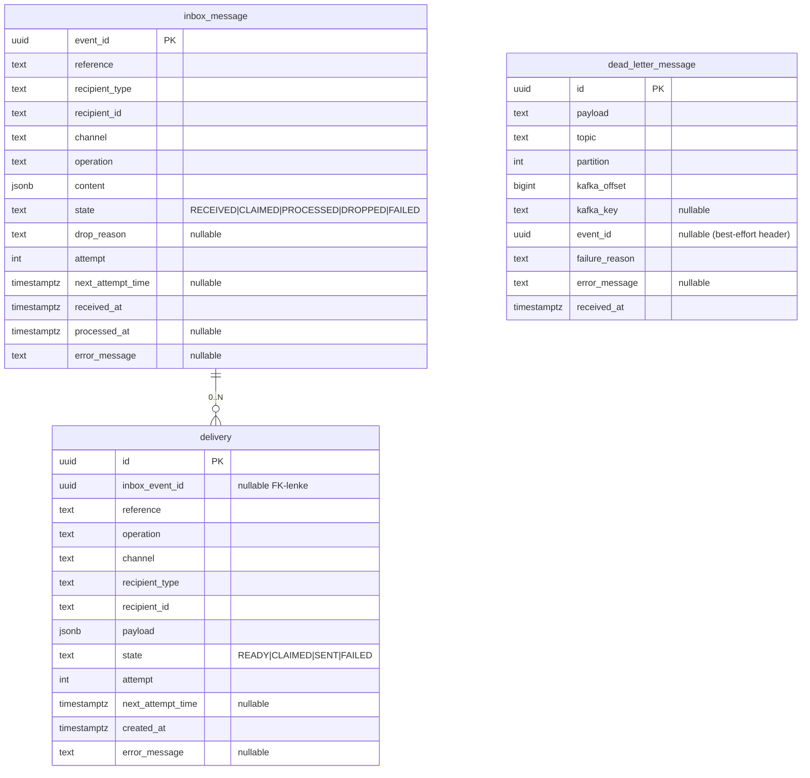

# Datamodell — syfo-budstikka

Datamodellen følger dagens kode. Kilden er `InboxMessageTable`, `DeliveryTable` og
`DeadLetterMessageTable` i `src/main/kotlin/no/nav/budstikka/infrastructure/database/`.

## Tabeller



## Inbox og dead letter

- Konsumenten **parser hele `Dispatch` ved ingest** (ADR 0008, superseder ADR 0002) og
  hydrerer `inbox_message`: dedup på `payload.eventId` (PK), strukturerte kolonner
  (`reference`/`recipient_type`/`recipient_id`/`channel`/`operation`) løftes ut, og
  `content` lagres som `jsonb`. Strukturerte felt gjør at FERDIGSTILL kan matche/annullere
  ennå-ubesluttede inbox-rader uten re-parsing (#27).
- `eventId`-headeren (`DispatchHeader.EVENT_ID`) er ikke lenger autoritativ; den leses
  best-effort **kun** når en melding dead-letteres, og lagres da som `event_id` på
  `dead_letter_message` (korrelasjon når payloaden ikke kan parses).
- Melding som ikke kan behandles ved inntak (manglende/tom payload, korrupt JSON, konvolutt
  uten `eventId`/`reference`, parser-urepresenterbar content) skrives til
  `dead_letter_message`; offset committes. En *representable-men-ulovlig* kombinasjon (B21)
  dead-letteres IKKE — den når inbox og håndteres av beslutnings-workeren.
- **Retensjon (B42 + ADR 0008):** `inbox_message` og `dead_letter_message` slettes hardt
  ved alder > ~100 dager (≥ 90d replay-vindu, B26, + buffer); DL bærer rå payload m/fnr og
  må ha samme slette-disiplin.

## Worker-flyt og state-overganger

### `inbox_message.state`

```text
RECEIVED -> CLAIMED -> PROCESSED
                   -> DROPPED
                   -> FAILED

CLAIMED -> CLAIMED (lease utløpt, kan re-claimes)
```

- Claim bruker `FOR UPDATE SKIP LOCKED` og lease via `next_attempt_time`.
- `attempt` økes ved claim.
- Terminal overgang (`PROCESSED`/`DROPPED`/`FAILED`) er compare-and-set fra `CLAIMED`.

### `delivery.state`

```text
READY -> CLAIMED -> SENT
                -> FAILED

CLAIMED -> CLAIMED (handler kaster, lease utløpt, kan re-claimes)
```

- Delivery-worker claimer bare kanaler den har `ChannelHandler` for.
- `markSent` og `markFailed` er compare-and-set fra `CLAIMED`.
- `attempt` økes ved claim.

## Indekser

- `inbox_message_state_next_attempt_time_idx` på `(state, next_attempt_time)`
- `delivery_state_next_attempt_time_idx` på `(state, next_attempt_time)`
- `delivery_inbox_event_id_idx` på `(inbox_event_id)`
- `dead_letter_message_received_at_idx` på `(received_at)`

## Observability-koblinger

- Primær korrelasjon er `eventId`.
- For delivery brukes også `delivery.id` for sporing av ett konkret sendeforsøk.
- Metrikklabels holdes lavkardinale; detaljer går i logger/traces.
