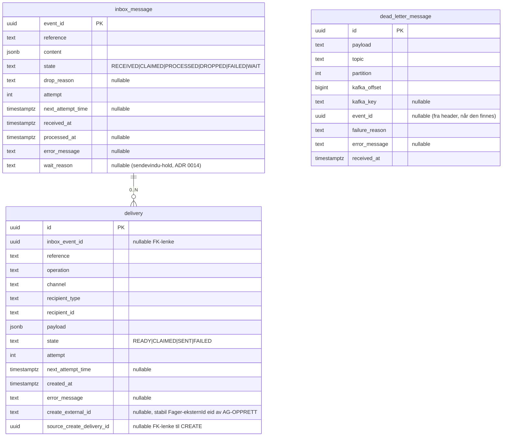

# Datamodell — syfo-budstikka

Datamodellen følger dagens kode. Kilden er `InboxMessageTable`, `DeliveryTable` og
`DeadLetterMessageTable` i `src/main/kotlin/no/nav/budstikka/infrastructure/database/`.

## Tabeller


```mermaid
erDiagram
    inbox_message ||--o{ delivery : "0..N"

    inbox_message {
        uuid        event_id PK
        text        reference
        jsonb       content
        text        state "RECEIVED|CLAIMED|PROCESSED|DROPPED|FAILED|WAIT"
        text        drop_reason "nullable"
        int         attempt
        timestamptz next_attempt_time "nullable"
        timestamptz received_at
        timestamptz processed_at "nullable"
        text        error_message "nullable"
        text        wait_reason "nullable (sendevindu-hold, ADR 0014)"
    }

    delivery {
        uuid        id PK
        uuid        inbox_event_id "nullable FK-lenke"
        text        reference
        text        operation
        text        channel
        text        recipient_type
        text        recipient_id
        jsonb       payload
        text        state "READY|CLAIMED|SENT|FAILED"
        int         attempt
        timestamptz next_attempt_time "nullable"
        timestamptz created_at
        text        error_message "nullable"
        text        create_external_id "nullable, stabil Fager-eksternId eid av AG-OPPRETT"
        uuid        source_create_delivery_id "nullable FK-lenke til CREATE"
    }

    dead_letter_message {
        uuid        id PK
        text        payload
        text        topic
        int         partition
        bigint      kafka_offset
        text        kafka_key "nullable"
        uuid        event_id "nullable (fra header, når den finnes)"
        text        failure_reason
        text        error_message "nullable"
        timestamptz received_at
    }
```

## Inbox og dead letter

- Konsumenten **parser hele `Dispatch` ved ingest** (ADR 0008) og
  hydrerer `inbox_message`: dedup på **header-eventId** (`DispatchHeader.EVENT_ID`) som PK,
  `content` lagres som `jsonb`, og `reference` løftes ut som egen kolonne (selektiv
  FERDIGSTILL-match-nøkkel + eneste konvolutt-felt utenfor `content`). recipient/channel
  utledes fra `content` (`partitionKey`/`type`) ved avgrensning. Dette gjør at FERDIGSTILL kan
  avgrense ennå-ubesluttede inbox-rader uten re-parsing (#27). Hold-plasseringen er avgjort til
  inbox-hold ([ADR 0014](adr/0014-inbox-hold-for-sendevindu.md)). FERDIGSTILL bruker
  `reference`-indeksen og den lagrede CREATE-discriminatoren til å finne og radlåse aktuelle
  OPPRETT-er i `RECEIVED`, `WAIT` eller `CLAIMED`; kanal og partisjonsanker verifiseres mot det
  hydrerte innholdet.
- `eventId` lever **kun** i Kafka-headeren (fjernet fra payloaden, `Dispatch = { reference,
  content }`); headeren er autoritativ og obligatorisk. Best-effort lagres eventId også på
  `dead_letter_message` (`event_id`) for korrelasjon når en melding dead-letteres.
- Melding som ikke kan behandles ved inntak (manglende/ugyldig header, tom payload, korrupt
  JSON, konvolutt uten `reference`, parser-urepresenterbar content) skrives til
  `dead_letter_message`; offset committes. En *representable-men-ulovlig* kombinasjon
  dead-letteres IKKE — den når inbox og håndteres av beslutnings-workeren.
- **Retensjon:** Oppryddingen er implementert og styres av
  `workers.retentionCleanup.enabled`. Workeren er aktivert i dev, men deaktivert i prod.
  Prodaktivering og policyverdiene 100/180 dager krever juridisk godkjenning. Når den er
  aktivert, sletter workeren hardt de 100 eldste kandidatene per tabell hver time
  (konfigurerbart). `inbox_message` og `dead_letter_message` slettes når `received_at` er
  strengt eldre enn 100 dager (≥ 90 dagers replay-vindu + buffer); DL bærer rå payload m/fnr og
  må ha samme slette-disiplin. Bare terminale `delivery`-rader (`SENT`/`FAILED`) med
  `created_at` strengt eldre enn 180 dager slettes. `source_create_delivery_id` har indeks og FK
  med `ON DELETE RESTRICT`: en source CREATE slettes ikke mens en dependent delivery fortsatt
  refererer til den. Terminale dependents slettes derfor først; source CREATE slettes i en senere
  oppryddingsrunde. En PostgreSQL advisory lock lar én replika kjøre hver opprydding; en replika
  som ikke får låsen hopper over runden. Sletting av en
  inbox-rad setter tilhørende `delivery.inbox_event_id` til `NULL` via FK-en.

## Worker-flyt og state-overganger

### Claim-algoritmen (ADR 0004)

Samme claim-mekanisme brukes i `inbox_message` og `delivery`, slik at flere podder
kan jobbe parallelt uten dobbelt-claim:

1. Les kandidater med `FOR UPDATE SKIP LOCKED`.
2. Velg både nye rader og utløpte claims:
   - inbox: `state=RECEIVED` eller `state=CLAIMED and next_attempt_time <= now`
   - delivery: `state=READY` eller `state=CLAIMED and next_attempt_time <= now`
3. Sorter deterministisk (`received_at`/`created_at`, deretter ID) og `LIMIT batchSize`.
4. Oppdater de valgte radene i samme transaksjon: `state = CLAIMED`,
   `next_attempt_time = now + lease`. Claim rører ikke `attempt`: forsøket spanderes
   først av `beginAttempt` (atomisk, gatet `UPDATE`) rett før første feilbare arbeid,
   slik at en claimet rad som aldri behandles (bunke-abort, oppbrukt lease-budsjett,
   krasj) beholder budsjettet sitt og ikke kan poison-`FAILED`-es urørt (ADR 0004).

### Transaksjonsgrenser

`saveBatch` og FERDIGSTILL med `Decision.Processed` tar samme eksklusive PostgreSQL advisory lock
per referanse. FERDIGSTILL tar referanselåsen før låsen på egen claimede inbox-rad og før
delivery- og kandidatsøk. Låsen er på transaksjonsnivå og holdes til commit
eller rollback, slik at kandidatsøk og terminalisering ikke slipper inn samtidige innsettinger
på samme referanse. En batch tar alle distinkte, hashede `bigint`-nøkler i numerisk rekkefølge
før første innsetting. Låsene bruker navnerommet for én `bigint`, adskilt fra delivery- og
retensjonslåsenes navnerom for to `int`. Ulike referanser serialiseres ikke globalt, og ingen
HTTP-kall holder denne transaksjonslåsen. Rekkefølgen hindrer en låsesyklus mellom tre sesjoner
med henholdsvis FERDIGSTILL, duplikatinnsetting og retensjon som sletter inbox-rader.
Retensjonspolicyen er uendret.

- **Kafka → inbox:** `InboxMessageHandler` skriver batch til `inbox_message` med
  `batchInsert(ignore = true)`; dedup på `event_id` (PK) fra Kafka-headeren.
- **Decision → delivery:** `EffectuateDecision` kjører i én DB-transaksjon og låser den
  claimede inbox-raden med `FOR UPDATE`, etter referanselåsen for FERDIGSTILL med
  `Decision.Processed`. Bare arbeideren som vinner låsingen av en fortsatt `CLAIMED` rad,
  fortsetter til delivery- og kandidatsøk. Tapt claim gir `Skipped` uten søk, tilstandsendringer
  eller delivery-skriving. `markProcessedInTransaction(eventId)` (CAS) skjer før
  `saveInTransaction(...)`, og delivery-rader skrives bare hvis CAS lykkes.
  `DeliveryRepository.saveInTransaction` bruker `batchInsert(draft)` for 0..N rader for samme
  inbox-melding. Ved FERDIGSTILL med `Decision.Processed` låses alle matchende,
  ikke-materialiserte OPPRETT-er i `RECEIVED`, `WAIT` eller `CLAIMED`, også når første
  delivery-oppslag allerede fant en CREATE.
  SQL avgrenser CREATE-discriminatoren før `FOR UPDATE`, så samtidige FERDIGSTILL-er ikke låser
  hverandres inbox-rader. Delivery leses på nytt etter låsene for å serialisere materialisering
  mot kansellering; alle låste OPPRETT-er avsluttes `PROCESSED` i samme transaksjon.
  `delivery_ferdigstill_match_idx` avgrenser delivery-oppslaget på match-nøkkelen og henter alle
  matchende OPPRETT-er mens transaksjonen holder radlåsene.

### `inbox_message.state`

```text
RECEIVED -> CLAIMED -> PROCESSED
                   -> DROPPED
                   -> FAILED
                   -> WAIT       (utenfor sendevindu, ADR 0014)

CLAIMED -> CLAIMED (lease utløpt, kan re-claimes)
WAIT    -> CLAIMED (sendevindu åpnet: next_attempt_time passert)
```

- Claim bruker `FOR UPDATE SKIP LOCKED` og lease via `next_attempt_time`.
- `attempt` teller behandlingsstarter (`beginAttempt`), ikke claims. Et sendevindu-hold
  (`WAIT`) leverer det spanderte forsøket tilbake (`attempt = 0`): venting er en planlagt
  utsettelse, ikke et feilforsøk, og skal ikke forbruke attempt-budsjettet (ADR 0014).
  Ellers kunne gjentatte sendevindu-hold poison-`FAILED`-e en legitimt ventende melding.
- Ventårsaken lagres i `wait_reason` (ikke `error_message`, som er forbeholdt reelle feil).
  `wait_reason` nullstilles ved terminal overgang og ved poison-`FAILED`.
- Terminal overgang (`PROCESSED`/`DROPPED`/`FAILED`) er compare-and-set fra `CLAIMED`:
  raden oppdateres atomisk bare mens den fortsatt har forventet state. Dette hindrer
  dobbeltprosessering når flere workere konkurrerer om samme rad.

### `delivery.state`

```text
READY -> CLAIMED -> SENT
                -> FAILED

CLAIMED -> CLAIMED (handler kaster, lease utløpt, kan re-claimes)
```

- Delivery-worker claimer bare kanaler den har `ChannelHandler` for
  (claim filtrerer på `handlers.keys`).
- En dependent `INACTIVATE` med `source_create_delivery_id` kan først claimes når dens eksakte
  source CREATE er `SENT`. Når source CREATE er `FAILED`, terminaliseres dependent som `FAILED`
  uten handlerkall eller nytt forsøk.
- FERDIGSTILL materialiserer en slik dependent for hver lagret `CREATE` som matcher reference,
  channel og recipient. Hver dependent peker til og avleder payload og ekstern ID fra sin eksakte
  source; en ugyldig eller `FAILED` source undertrykker ikke andre matchende closes.
- `markSent` og `markFailed` er compare-and-set fra `CLAIMED`.
- `attempt` spanderes av `beginAttempt` rett før handleren kalles, ikke ved claim.
  Manglende handler er en konfigurasjonsfeil og brenner ikke et forsøk.
- PostgreSQL session advisory lock serialiserer dispatch av source CREATE og dens dependents per
  source, også mellom replikaer. Låsen holdes gjennom handlerkall og terminal state-overgang.

## Indekser

- `inbox_message_state_next_attempt_time_idx` på `(state, next_attempt_time)`
- `inbox_message_received_at_event_id_idx` på `(received_at, event_id)`
- `inbox_message_reference_idx` på `(reference)` for FERDIGSTILL-matching mot inbox-hold
- `delivery_state_next_attempt_time_idx` på `(state, next_attempt_time)`
- `delivery_inbox_event_id_idx` på `(inbox_event_id)`
- `delivery_source_create_delivery_id_idx` på `(source_create_delivery_id)`
- `delivery_created_at_id_sent_failed_idx` på `(created_at, id)` der `state IN ('SENT', 'FAILED')`
- `delivery_ferdigstill_match_idx` på
  `(reference, operation, channel, recipient_type, recipient_id, created_at, id)` for
  FERDIGSTILL-matching mot delivery
- `dead_letter_message_received_at_id_idx` på `(received_at, id)`

## Id-generering

- `delivery.id` genereres av databasen: Postgres 18 `uuidv7()` (tidssortert) som
  kolonne-default i Flyway-migreringen, markert `.databaseGenerated()` i Exposed slik at
  id-en leses tilbake i stedet for å sendes inn (ikke `.autoGenerate()`, som lager en
  klient-side v4). Tidssortering gir B-tree-lokalitet og støtter alders-basert
  retensjons-`DELETE`.
- `event_id` settes alltid av produsenten (Kafka-headeren i kontrakten), aldri av
  budstikkas database.
- En ARBEIDSGIVERVARSEL-`OPPRETT` fryser Fagers stabile eksternId i
  `delivery.create_external_id` ved materialisering: create-radens `inbox_event_id`. En
  kompatibilitets-trigger i V11 setter samme verdi ved innsetting i `delivery` for eldre skrivere
  som utelater kolonnen; den beskytter ikke innsetting i inbox. Mangler
  den opprinnelige inbox-identiteten, kan eksternId ikke gjenopprettes: V9s `delivery.id`-gjett
  ryddes til ukjent og både publisering og `INAKTIVER` feiler terminalt uten Fager-kall. Samme
  frosne verdi kopieres til avledet `INAKTIVER`, så en kjent identitet overlever inbox-retensjon.

## Observability-koblinger

- Primær korrelasjon er `eventId`.
- For delivery brukes også `delivery.id` for sporing av ett konkret sendeforsøk.
- Metrikklabels holdes lavkardinale; detaljer går i logger/traces.
- Terminale FERDIGSTILL-no-op-er telles med `ferdigstill_uten_treff`,
  `ferdigstill_uten_runtime_kanal` eller `ferdigstill_lagret_opprett_ugyldig`; de har ingen
  identifikator- eller payload-label.
