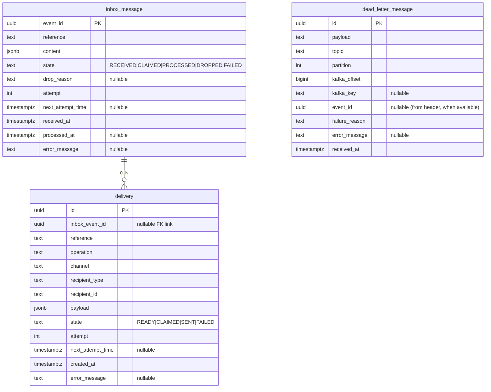

# Data model — syfo-budstikka

The data model follows the current code. Its sources are `InboxMessageTable`,
`DeliveryTable`, and `DeadLetterMessageTable` in
`src/main/kotlin/no/nav/budstikka/infrastructure/database/`.

## Tables


```mermaid
erDiagram
    inbox_message ||--o{ delivery : "0..N"

    inbox_message {
        uuid        event_id PK
        text        reference
        jsonb       content
        text        state "RECEIVED|CLAIMED|PROCESSED|DROPPED|FAILED"
        text        drop_reason "nullable"
        int         attempt
        timestamptz next_attempt_time "nullable"
        timestamptz received_at
        timestamptz processed_at "nullable"
        text        error_message "nullable"
    }

    delivery {
        uuid        id PK
        uuid        inbox_event_id "nullable FK link"
        text        reference
        text        operation
        text        channel
        text        recipient_type
        text        recipient_id
        jsonb       payload
        text        state "READY|CLAIMED|SENT|FAILED"
        int         attempt
        timestamptz next_attempt_time "nullable"
        timestamptz created_at
        text        error_message "nullable"
    }

    dead_letter_message {
        uuid        id PK
        text        payload
        text        topic
        int         partition
        bigint      kafka_offset
        text        kafka_key "nullable"
        uuid        event_id "nullable (from header, when available)"
        text        failure_reason
        text        error_message "nullable"
        timestamptz received_at
    }
```

## Inbox and dead letter

- At ingest, the consumer **parses the full `Dispatch`** (ADR 0008, superseding ADR 0002)
  and hydrates `inbox_message`: it deduplicates on the **header eventId**
  (`DispatchHeader.EVENT_ID`) as the PK, stores `content` as `jsonb`, and extracts
  `reference` to its own column (the selective FERDIGSTILL matching key and the only
  envelope field outside `content`). Recipient and channel are derived from `content`
  (`partitionKey`/`type`) at the boundary. This lets FERDIGSTILL match or delimit
  undecided inbox rows without reparsing (#27). Add further matching columns only if
  B61's open hold-placement question resolves to inbox hold.
- `eventId` exists **only** in the Kafka header (removed from the payload;
  `Dispatch = { reference, content }`). The header is authoritative and mandatory.
  Store it best-effort in `dead_letter_message.event_id` for correlation when a
  message is dead-lettered.
- A message that cannot be handled at ingest (missing or invalid header, empty payload,
  corrupt JSON, an envelope without `reference`, or parser-unrepresentable content) is
  written to `dead_letter_message` and its offset is committed. A
  *representable-but-illegal* combination (B21) is **not** dead-lettered: it reaches
  the inbox and is handled by the decision worker.
- **Retention (B42 + ADR 0008):** hard-delete `inbox_message` and
  `dead_letter_message` after about 100 days (the ≥90-day replay window, B26, plus a
  buffer). DL contains raw payload with fnr and needs the same deletion discipline.

## Worker flow and state transitions

### `inbox_message.state`

```text
RECEIVED -> CLAIMED -> PROCESSED
                   -> DROPPED
                   -> FAILED

CLAIMED -> CLAIMED (lease expired; can be reclaimed)
```

- Claims use `FOR UPDATE SKIP LOCKED` and a lease through `next_attempt_time`.
- `attempt` increases on claim.
- A terminal transition (`PROCESSED`/`DROPPED`/`FAILED`) is compare-and-set from `CLAIMED`.

### `delivery.state`

```text
READY -> CLAIMED -> SENT
                -> FAILED

CLAIMED -> CLAIMED (handler throws; lease expires; can be reclaimed)
```

- The delivery worker claims only channels for which it has a `ChannelHandler`.
- `markSent` and `markFailed` are compare-and-set from `CLAIMED`.
- `attempt` increases on claim.

## Indexes

- `inbox_message_state_next_attempt_time_idx` on `(state, next_attempt_time)`
- `delivery_state_next_attempt_time_idx` on `(state, next_attempt_time)`
- `delivery_inbox_event_id_idx` on `(inbox_event_id)`
- `dead_letter_message_received_at_idx` on `(received_at)`

> Add an index on `inbox_message.reference` together with FERDIGSTILL matching against
> the inbox, only if B61's open hold-placement question resolves to inbox hold. The column
> exists from the start (ADR 0008); the index arrives with that work.

## Observability links

- `eventId` is the primary correlation value.
- For delivery, use `delivery.id` to trace one concrete send attempt.
- Keep metric labels low-cardinality; put details in logs and traces.
