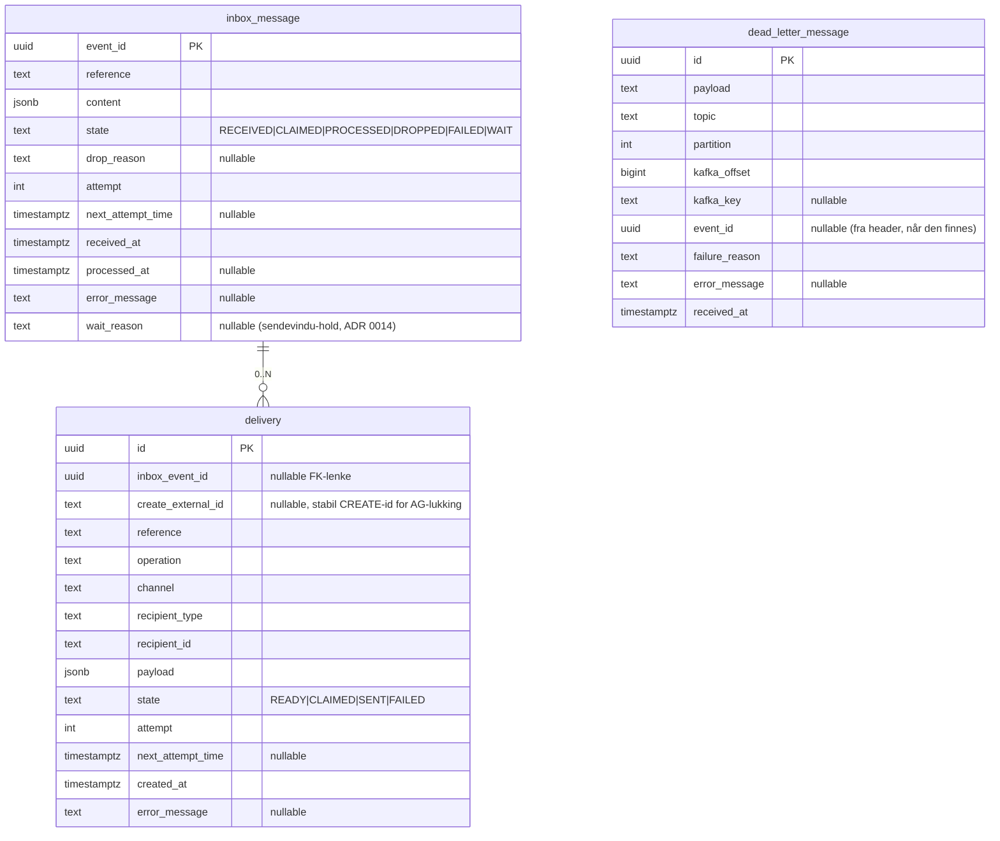

# Datamodell — syfo-budstikka

Datamodellen følger dagens kode. Kilden er `InboxMessageTable`, `DeliveryTable` og
`DeadLetterMessageTable` i `src/main/kotlin/no/nav/budstikka/infrastructure/database/`.

## Tabeller


```mermaid
erDiagram
    inbox_message ||--o{ delivery : "0..N"

    inbox_message {
        uuid        event_id PK
        text        reference
        jsonb       content
        text        state "RECEIVED|CLAIMED|PROCESSED|DROPPED|FAILED|WAIT"
        text        drop_reason "nullable"
        int         attempt
        timestamptz next_attempt_time "nullable"
        timestamptz received_at
        timestamptz processed_at "nullable"
        text        error_message "nullable"
        text        wait_reason "nullable (sendevindu-hold, ADR 0014)"
    }

    delivery {
        uuid        id PK
        uuid        inbox_event_id "nullable FK-lenke"
        text        create_external_id "nullable, stabil CREATE-id for AG-lukking"
        text        reference
        text        operation
        text        channel
        text        recipient_type
        text        recipient_id
        jsonb       payload
        text        state "READY|CLAIMED|SENT|FAILED"
        int         attempt
        timestamptz next_attempt_time "nullable"
        timestamptz created_at
        text        error_message "nullable"
    }

    dead_letter_message {
        uuid        id PK
        text        payload
        text        topic
        int         partition
        bigint      kafka_offset
        text        kafka_key "nullable"
        uuid        event_id "nullable (fra header, når den finnes)"
        text        failure_reason
        text        error_message "nullable"
        timestamptz received_at
    }
```

## Inbox og dead letter

- Konsumenten **parser hele `Dispatch` ved ingest** (ADR 0008) og
  hydrerer `inbox_message`: dedup på **header-eventId** (`DispatchHeader.EVENT_ID`) som PK,
  `content` lagres som `jsonb`, og `reference` løftes ut som egen kolonne (selektiv
  FERDIGSTILL-match-nøkkel + eneste konvolutt-felt utenfor `content`). recipient/channel
  utledes fra `content` når workeren avgrenser matchende ventende CREATE-rader. Dette gjør at
  FERDIGSTILL kan matche både lagrede leveranser og ennå-ubesluttede inbox-rader uten å lagre
  rå PII i egne hjelpekolonner.
- `eventId` lever **kun** i Kafka-headeren (fjernet fra payloaden, `Dispatch = { reference,
  content }`); headeren er autoritativ og obligatorisk. Best-effort lagres eventId også på
  `dead_letter_message` (`event_id`) for korrelasjon når en melding dead-letteres.
- Melding som ikke kan behandles ved inntak (manglende/ugyldig header, tom payload, korrupt
  JSON, konvolutt uten `reference`, parser-urepresenterbar content) skrives til
  `dead_letter_message`; offset committes. En *representable-men-ulovlig* kombinasjon
  dead-letteres IKKE — den når inbox og håndteres av beslutnings-workeren.
- **Retensjon:** Oppryddingen er implementert og styres av
  `workers.retentionCleanup.enabled`. Workeren er aktivert i dev og deaktivert i prod i dag.
  Når den kjører, sletter den hardt de 100 eldste kandidatene per tabell hver time
  (konfigurerbart). `inbox_message` og `dead_letter_message` slettes når `received_at` er
  strengt eldre enn 100 dager; bare terminale `delivery`-rader (`SENT`/`FAILED`) med
  `created_at` strengt eldre enn 180 dager slettes. En PostgreSQL advisory lock lar én replika
  kjøre hver opprydding; en replika som ikke får låsen hopper over runden. Sletting av en
  inbox-rad setter tilhørende `delivery.inbox_event_id` til `NULL` via FK-en. Derfor lagres
  arbeidsgivervarsel-CREATE sin stabile Fager-id også i `delivery.create_external_id`, slik at en
  senere FERDIGSTILL fortsatt kan lukke varselet etter inbox-retensjon. Historiske CREATE-rader
  der denne id-en ikke kunne gjenfinnes, behandles som ugyldig lagret CREATE ved FERDIGSTILL.

## Worker-flyt og state-overganger

### Claim-algoritmen (ADR 0004)

Samme claim-mekanisme brukes i `inbox_message` og `delivery`, slik at flere podder
kan jobbe parallelt uten dobbelt-claim:

1. Les kandidater med `FOR UPDATE SKIP LOCKED`.
2. Velg både nye rader og utløpte claims:
   - inbox: `state=RECEIVED` eller `state=CLAIMED and next_attempt_time <= now`
   - delivery: `state=READY` eller `state=CLAIMED and next_attempt_time <= now`
3. Sorter deterministisk (`received_at`/`created_at`, deretter ID) og `LIMIT batchSize`.
4. Oppdater de valgte radene i samme transaksjon: `state = CLAIMED`,
   `next_attempt_time = now + lease`. Claim rører ikke `attempt`: forsøket spanderes
   først av `beginAttempt` (atomisk, gatet `UPDATE`) rett før første feilbare arbeid,
   slik at en claimet rad som aldri behandles (bunke-abort, oppbrukt lease-budsjett,
   krasj) beholder budsjettet sitt og ikke kan poison-`FAILED`-es urørt (ADR 0004).

### Transaksjonsgrenser

- **Kafka → inbox:** `InboxMessageHandler` skriver batch til `inbox_message` med
  `batchInsert(ignore = true)`; dedup på `event_id` (PK) fra Kafka-headeren.
- **Decision → delivery:** `EffectuateDecision` kjører i én DB-transaksjon:
  `markProcessedInTransaction(eventId)` først (CAS), deretter `saveInTransaction(...)`
  av delivery-rader bare hvis CAS lykkes. `DeliveryRepository.saveInTransaction`
  bruker `batchInsert(draft)` for 0..N rader for samme inbox-melding.
- **FERDIGSTILL i samme transaksjon:** workeren låser først den claimede FERDIGSTILL-raden,
  deretter alle matchende CREATE-rader i `WAIT` eller vekket `CLAIMED` med `wait_reason`,
  og leser lagret CREATE på nytt etter disse låsene. Utfallet er enten:
  1. lagret CREATE i `SENT` → lagre avledet `INACTIVATE`-delivery
  2. lagret CREATE i `READY` / `CLAIMED` → legg FERDIGSTILL i kort teknisk `WAIT`
  3. lagret CREATE i `FAILED` → marker FERDIGSTILL `PROCESSED`, uten delivery
  4. bare ventende CREATE → marker disse `PROCESSED`, uten delivery
  5. ingen/ugyldig match → marker FERDIGSTILL `PROCESSED`, uten delivery

### `inbox_message.state`

```text
RECEIVED -> CLAIMED -> PROCESSED
                   -> DROPPED
                   -> FAILED
                   -> WAIT       (utenfor sendevindu eller kort FERDIGSTILL-recheck, ADR 0014)

CLAIMED -> CLAIMED (lease utløpt, kan re-claimes)
WAIT    -> CLAIMED (planlagt resume: next_attempt_time passert)
WAIT    -> PROCESSED (matching FERDIGSTILL kansellerer før materialisering)
```

- Claim bruker `FOR UPDATE SKIP LOCKED` og lease via `next_attempt_time`.
- `attempt` teller behandlingsstarter (`beginAttempt`), ikke claims. Et sendevindu-hold
  eller en teknisk FERDIGSTILL-utsettelse (`WAIT`) leverer det spanderte forsøket tilbake
  (`attempt = 0`): venting er en planlagt utsettelse, ikke et feilforsøk, og skal ikke
  forbruke attempt-budsjettet (ADR 0014).
  Ellers kunne gjentatte sendevindu-hold poison-`FAILED`-e en legitimt ventende melding.
- Ventårsaken lagres i `wait_reason` (ikke `error_message`, som er forbeholdt reelle feil).
  For FERDIGSTILL-recheck brukes den faste tekniske verdien
  `AWAITING_MATCHING_CREATE_SENT`. `wait_reason` nullstilles ved terminal overgang og ved
  poison-`FAILED`.
- En oppvåknet `CLAIMED`-rad med satt `wait_reason` behandles fortsatt som en tidligere
  ventende CREATE, og kan derfor låses og markeres `PROCESSED` av en matchende FERDIGSTILL.
- Terminal overgang (`PROCESSED`/`DROPPED`/`FAILED`) er compare-and-set fra `CLAIMED`:
  raden oppdateres atomisk bare mens den fortsatt har forventet state. Dette hindrer
  dobbeltprosessering når flere workere konkurrerer om samme rad.

### `delivery.state`

```text
READY -> CLAIMED -> SENT
                -> FAILED

CLAIMED -> CLAIMED (handler kaster, lease utløpt, kan re-claimes)
```

- Delivery-worker claimer bare kanaler den har `ChannelHandler` for
  (claim filtrerer på `handlers.keys`).
- `markSent` og `markFailed` er compare-and-set fra `CLAIMED`.
- `attempt` spanderes av `beginAttempt` rett før handleren kalles, ikke ved claim.
  Manglende handler er en konfigurasjonsfeil og brenner ikke et forsøk.
- For `ARBEIDSGIVERVARSEL + CREATE` lagres den stabile downstream-id-en i
  `create_external_id` når delivery-raden materialiseres. Avledet `INACTIVATE` bruker samme felt.
- Bare lagret CREATE i `SENT` kan avlede en FERDIGSTILL-`INACTIVATE`; `READY` / `CLAIMED`
  holder FERDIGSTILL kort i inbox-`WAIT`, og `FAILED` gjør FERDIGSTILL terminal uten outbound close.
- For `ARBEIDSGIVERVARSEL + INACTIVATE` behandles Fagers `NotifikasjonFinnesIkke` som transient:
  raden blir ikke lokalt `SENT`, men følger vanlig lease-retry/poison-løype.

## FERDIGSTILL-matchflater

- **Lagret CREATE-delivery:** oppslag på
  `(reference, operation='CREATE', channel, recipient_type, recipient_id)`.
- **Ventende CREATE i inbox:** oppslag via `reference`, der låste rader valideres mot
  FERDIGSTILLs `(channel, recipient)` basert på lagret `content`.
- Bare `WAIT`-rader og `CLAIMED`-rader med `wait_reason` deltar i direkte kansellering.
  Vanlige `RECEIVED`-rader og `CLAIMED`-rader uten `wait_reason` gjør det ikke.

## Indekser

- `inbox_message_state_next_attempt_time_idx` på `(state, next_attempt_time)`
- `inbox_message_received_at_event_id_idx` på `(received_at, event_id)`
- `inbox_message_reference_idx` på `(reference)`
- `delivery_state_next_attempt_time_idx` på `(state, next_attempt_time)`
- `delivery_inbox_event_id_idx` på `(inbox_event_id)`
- `delivery_ferdigstill_match_idx` på
  `(reference, operation, channel, recipient_type, recipient_id, created_at, id)`
- `delivery_created_at_id_sent_failed_idx` på `(created_at, id)` der `state IN ('SENT', 'FAILED')`
- `dead_letter_message_received_at_id_idx` på `(received_at, id)`

## Id-generering

- `delivery.id` genereres av databasen: Postgres 18 `uuidv7()` (tidssortert) som
  kolonne-default i Flyway-migreringen, markert `.databaseGenerated()` i Exposed slik at
  id-en leses tilbake i stedet for å sendes inn (ikke `.autoGenerate()`, som lager en
  klient-side v4). Tidssortering gir B-tree-lokalitet og støtter alders-basert
  retensjons-`DELETE`.
- `event_id` settes alltid av produsenten (Kafka-headeren i kontrakten), aldri av
  budstikkas database.

## Observability-koblinger

- Primær korrelasjon er `eventId`.
- For delivery brukes også `delivery.id` for sporing av ett konkret sendeforsøk.
- Metrikklabels holdes lavkardinale; detaljer går i logger/traces.
