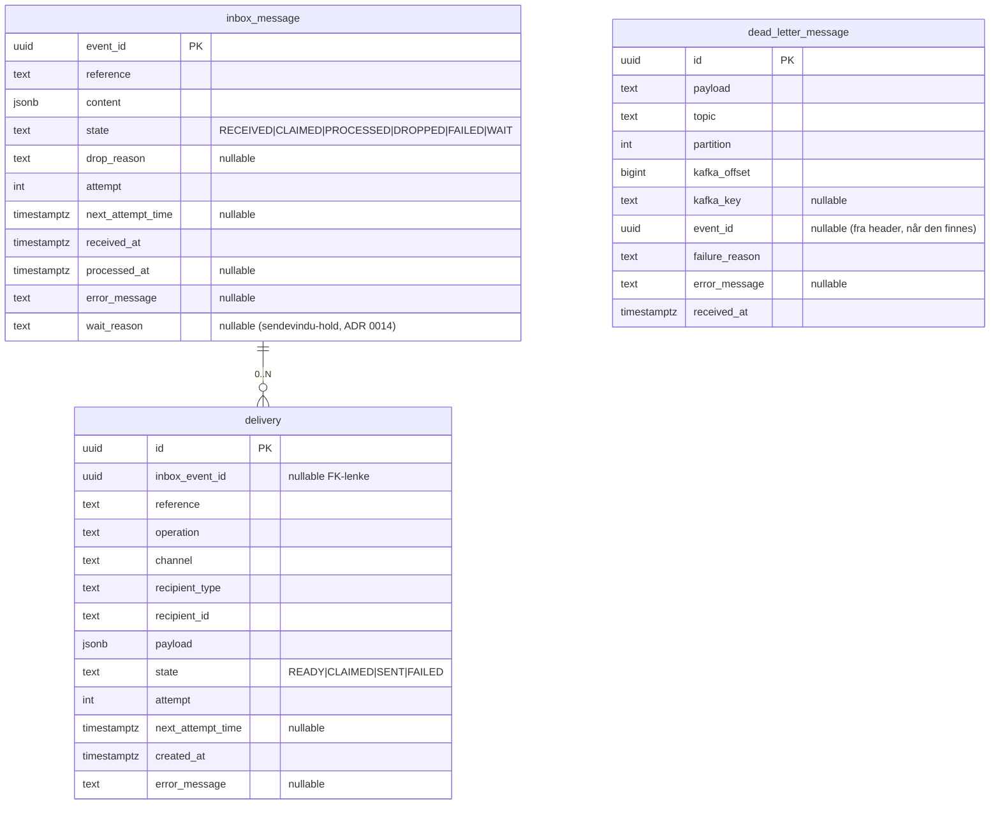

# Datamodell — syfo-budstikka

Datamodellen følger dagens kode. Kilden er `InboxMessageTable`, `DeliveryTable` og
`DeadLetterMessageTable` i `src/main/kotlin/no/nav/budstikka/infrastructure/database/`.

## Tabeller


```mermaid
erDiagram
    inbox_message ||--o{ delivery : "0..N"

    inbox_message {
        uuid        event_id PK
        text        reference
        jsonb       content
        text        state "RECEIVED|CLAIMED|PROCESSED|DROPPED|FAILED|WAIT"
        text        drop_reason "nullable"
        int         attempt
        timestamptz next_attempt_time "nullable"
        timestamptz received_at
        timestamptz processed_at "nullable"
        text        error_message "nullable"
        text        wait_reason "nullable (sendevindu-hold, ADR 0014)"
    }

    delivery {
        uuid        id PK
        uuid        inbox_event_id "nullable FK-lenke"
        text        reference
        text        operation
        text        channel
        text        recipient_type
        text        recipient_id
        jsonb       payload
        text        state "READY|CLAIMED|SENT|FAILED"
        int         attempt
        timestamptz next_attempt_time "nullable"
        timestamptz created_at
        text        error_message "nullable"
    }

    dead_letter_message {
        uuid        id PK
        text        payload
        text        topic
        int         partition
        bigint      kafka_offset
        text        kafka_key "nullable"
        uuid        event_id "nullable (fra header, når den finnes)"
        text        failure_reason
        text        error_message "nullable"
        timestamptz received_at
    }
```

## Inbox og dead letter

- Konsumenten **parser hele `Dispatch` ved ingest** (ADR 0008) og
  hydrerer `inbox_message`: dedup på **header-eventId** (`DispatchHeader.EVENT_ID`) som PK,
  `content` lagres som `jsonb`, og `reference` løftes ut som egen kolonne (selektiv
  FERDIGSTILL-match-nøkkel + eneste konvolutt-felt utenfor `content`). recipient/channel
  utledes fra `content` (`partitionKey`/`type`) ved avgrensning. Dette gjør at FERDIGSTILL kan
  matche/avgrense ennå-ubesluttede inbox-rader uten re-parsing (#27). Hold-plasseringen er
  avgjort til inbox-hold ([ADR 0014](adr/0014-inbox-hold-for-sendevindu.md)); ytterligere
  match-kolonner legges til med det FERDIGSTILL-mot-inbox-arbeidet.
- `eventId` lever **kun** i Kafka-headeren (fjernet fra payloaden, `Dispatch = { reference,
  content }`); headeren er autoritativ og obligatorisk. Best-effort lagres eventId også på
  `dead_letter_message` (`event_id`) for korrelasjon når en melding dead-letteres.
- Melding som ikke kan behandles ved inntak (manglende/ugyldig header, tom payload, korrupt
  JSON, konvolutt uten `reference`, parser-urepresenterbar content) skrives til
  `dead_letter_message`; offset committes. En *representable-men-ulovlig* kombinasjon (B21)
  dead-letteres IKKE — den når inbox og håndteres av beslutnings-workeren.
- **Retensjon (B42 + ADR 0008):** `inbox_message` og `dead_letter_message` slettes hardt
  ved alder > ~100 dager (≥ 90d replay-vindu, B26, + buffer); DL bærer rå payload m/fnr og
  må ha samme slette-disiplin.

## Worker-flyt og state-overganger

### Claim-algoritmen (ADR 0004)

Samme claim-mekanisme brukes i `inbox_message` og `delivery`, slik at flere podder
kan jobbe parallelt uten dobbelt-claim:

1. Les kandidater med `FOR UPDATE SKIP LOCKED`.
2. Velg både nye rader og utløpte claims:
   - inbox: `state=RECEIVED` eller `state=CLAIMED and next_attempt_time <= now`
   - delivery: `state=READY` eller `state=CLAIMED and next_attempt_time <= now`
3. Sorter deterministisk (`received_at`/`created_at`, deretter ID) og `LIMIT batchSize`.
4. Oppdater de valgte radene i samme transaksjon: `state = CLAIMED`,
   `next_attempt_time = now + lease`, `attempt = attempt + 1`.

### Transaksjonsgrenser

- **Kafka → inbox:** `InboxMessageHandler` skriver batch til `inbox_message` med
  `batchInsert(ignore = true)`; dedup på `event_id` (PK) fra Kafka-headeren.
- **Decision → delivery:** `EffectuateDecision` kjører i én DB-transaksjon:
  `markProcessedInTransaction(eventId)` først (CAS), deretter `saveInTransaction(...)`
  av delivery-rader bare hvis CAS lykkes. `DeliveryRepository.saveInTransaction`
  bruker `batchInsert(draft)` for 0..N rader for samme inbox-melding.

### `inbox_message.state`

```text
RECEIVED -> CLAIMED -> PROCESSED
                   -> DROPPED
                   -> FAILED
                   -> WAIT       (utenfor sendevindu, ADR 0014)

CLAIMED -> CLAIMED (lease utløpt, kan re-claimes)
WAIT    -> CLAIMED (sendevindu åpnet: next_attempt_time passert)
```

- Claim bruker `FOR UPDATE SKIP LOCKED` og lease via `next_attempt_time`.
- `attempt` økes ved claim, men **ikke** når en `WAIT`-rad vekkes: venting er en planlagt
  utsettelse, ikke et feilforsøk, og skal ikke forbruke attempt-budsjettet (ADR 0014). Ellers
  kunne gjentatte sendevindu-hold poison-`FAILED`-e en legitimt ventende melding.
- Ventårsaken lagres i `wait_reason` (ikke `error_message`, som er forbeholdt reelle feil).
  `wait_reason` nullstilles ved terminal overgang og ved poison-`FAILED`.
- Terminal overgang (`PROCESSED`/`DROPPED`/`FAILED`) er compare-and-set fra `CLAIMED`:
  raden oppdateres atomisk bare mens den fortsatt har forventet state. Dette hindrer
  dobbeltprosessering når flere workere konkurrerer om samme rad.

### `delivery.state`

```text
READY -> CLAIMED -> SENT
                -> FAILED

CLAIMED -> CLAIMED (handler kaster, lease utløpt, kan re-claimes)
```

- Delivery-worker claimer bare kanaler den har `ChannelHandler` for
  (claim filtrerer på `handlers.keys`).
- `markSent` og `markFailed` er compare-and-set fra `CLAIMED`.
- `attempt` økes ved claim.

## Indekser

- `inbox_message_state_next_attempt_time_idx` på `(state, next_attempt_time)`
- `delivery_state_next_attempt_time_idx` på `(state, next_attempt_time)`
- `delivery_inbox_event_id_idx` på `(inbox_event_id)`
- `dead_letter_message_received_at_idx` på `(received_at)`

> Indeks på `inbox_message.reference` legges til sammen med FERDIGSTILL-matching mot inbox.
> Hold-plasseringen er avgjort til inbox-hold i
> [ADR 0014](adr/0014-inbox-hold-for-sendevindu.md), så indeksen hører til det arbeidet.
> Kolonnen finnes fra starten (ADR 0008).

## Observability-koblinger

- Primær korrelasjon er `eventId`.
- For delivery brukes også `delivery.id` for sporing av ett konkret sendeforsøk.
- Metrikklabels holdes lavkardinale; detaljer går i logger/traces.
