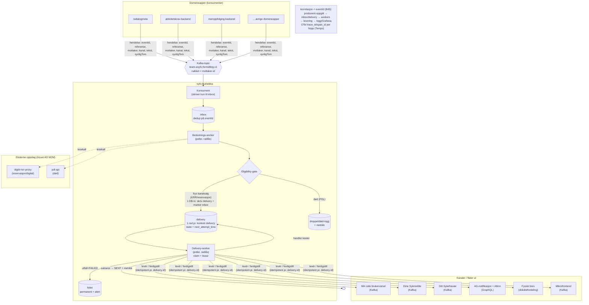

# Overordnet flyt — syfo-budstikka

Domeneblind varselruter. Konsument eier *hva/når*, budstikka eier *hvordan det leveres*.
Tre faser: **Inbox → Beslutning → Delivery**, decoupled workers med radlås.

## Lesehjelp
- **Konsument → inbox:** rask, idempotent (dedup på `eventId`). KRR/PDL-treghet gir ikke Kafka-lag.
- **Beslutnings-worker:** kjører eligibility-gate. Død → droppet-logg. Ellers fryses kanalvalg
  (reservasjon påvirker kun ekstern varsling / brev-fallback) til konkrete outbox-rader i én DB-tx.
- **Delivery-worker:** claimer READY-rader, leverer, og setter SENT/FAILED. Kaster en handler, blir raden stående CLAIMED til lease utløper og kan re-claimes.
- **FERDIGSTILL:** egen hendelse, samme flyt; leveransen lukker tidligere varsel matchet på `referanse`
  (brev kan ikke lukkes).
- **Skalering:** radlås (`FOR UPDATE SKIP LOCKED`) lar flere podder dele last uten dobbeltlevering.
