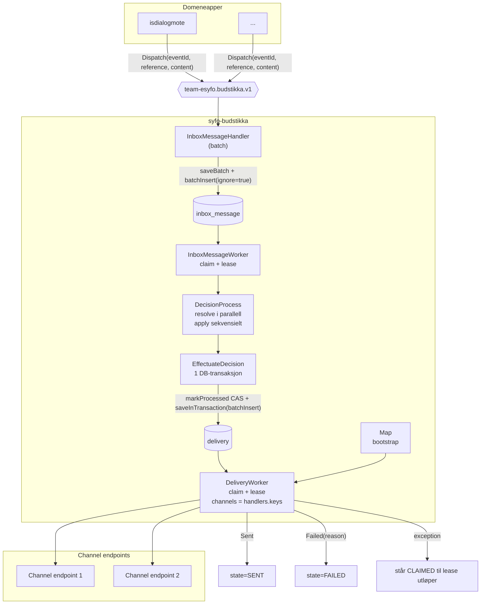

# Overordnet flyt — syfo-budstikka

Budstikka er en tredelt pipeline: **Kafka-consumer → Inbox → Decision → Delivery**.
Konsument eier *hva/når*, budstikka eier *hvordan*.

## Claim og lease

Samme claim-mekanisme brukes i `inbox_message` og `delivery`:

1. Les kandidater med `FOR UPDATE SKIP LOCKED`.
2. Velg både nye rader og utløpte claims:
   - inbox: `state=RECEIVED` eller `state=CLAIMED and next_attempt_time <= now`
   - delivery: `state=READY` eller `state=CLAIMED and next_attempt_time <= now`
3. Sorter deterministisk (`received_at/created_at`, deretter ID) og `LIMIT batchSize`.
4. Oppdater de valgte radene i samme transaksjon:
   - `state = CLAIMED`
   - `next_attempt_time = now + lease`
   - `attempt = attempt + 1`

Dette gjør at flere podder kan jobbe parallelt uten dobbelt-claim.

## Batch insert og transaksjonsgrense

- **Kafka → inbox:** `InboxMessageHandler` skriver batch til `inbox_message` med
  `batchInsert(ignore = true)`. Dedup skjer på `event_id` (PK).
- **Decision → delivery:** `EffectuateDecision` kjører i én DB-transaksjon:
  `markProcessedInTransaction(eventId)` først (CAS), deretter `saveInTransaction(...)` av
  delivery-rader bare hvis CAS lykkes.
- **Delivery-skriving:** `DeliveryRepository.saveInTransaction` bruker `batchInsert(draft)` for
  0..N rader for samme inbox-melding.

## Decision pattern (fetch, then decide)

`DecisionProcess` er delt i to steg:

1. **Fetch/resolve i parallell:** alle `DecisionRule.resolve(event)` kjøres med `async/awaitAll`.
2. **Decide/apply sekvensielt:** de resolverte reglene foldes i rekkefølge over deliveries.
   Første `Dropped`/`Failed` stopper resten (short-circuit).

Dette gir lavere latens på oppslag, men fortsatt forutsigbar regelrekkefølge i selve beslutningen.

## Kanal-mapping

Kanal velges og brukes i to ulike maps:

1. **DispatchContent → DeliveryDraft** (`DispatchDraftMapping`): setter `operation`, `channel` og
   `recipient` for hver meldingstype.
2. **Channel → ChannelHandler** (`Map<Channel, ChannelHandler>` i `WorkerModule`): bestemmer hvilken
   handler som faktisk kan levere claimed rader.

Delivery-claim filtrerer på `handlers.keys`, så workeren henter bare kanaler som er registrert i
map-et. Nye kanaler legges til ved å registrere en `ChannelHandler` i dette map-et.
