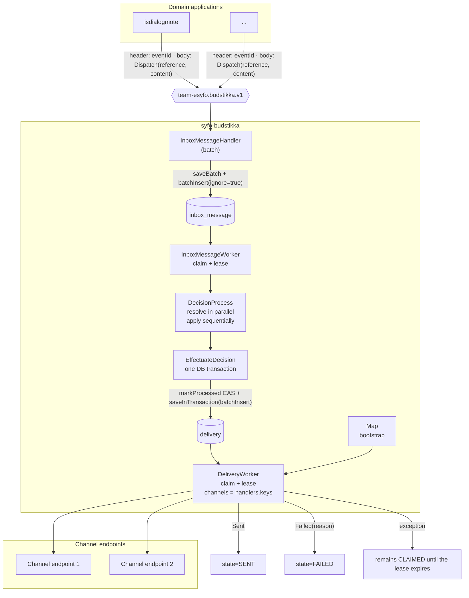

# Overall flow — syfo-budstikka

## Flow overview

Budstikka uses a staged pipeline: **Kafka consumer → Inbox → Decision → Delivery**.
The consumer owns *what and when*; budstikka owns *how*.

1. **InboxMessageHandler** (`infrastructure/kafka/consumer/`) consumes, parses, and
   stores the message in the inbox, or sends it to the dead-letter store on failure.
2. **InboxMessageWorker** (`application/`) claims messages and runs the decision.
3. **DecisionProcess** (`domain/decision/`) evaluates the rules and produces a
   `Decision`.
4. **EffectuateDecision** (`application/`) effectuates the decision by creating
   deliveries and marking the inbox message as processed.
5. **DeliveryWorker** (`application/`) claims deliveries and forwards them to a
   handler.
6. **ChannelHandler** (`application/`) sends the delivery to its channel endpoint.

```mermaid
flowchart TB
    subgraph Producers["Domain applications"]
        P1["isdialogmote"]
        P2["..."]
    end

    P1 & P2 -->|"header: eventId · body: Dispatch(reference, content)"| TOPIC{{"team-esyfo.budstikka.v1"}}

    subgraph Budstikka["syfo-budstikka"]
        direction TB
        CONS["InboxMessageHandler<br/>(batch)"]
        INBOX[("inbox_message")]
        IWORK["InboxMessageWorker<br/>claim + lease"]
        DEC["DecisionProcess<br/>resolve in parallel<br/>apply sequentially"]
        EFF["EffectuateDecision<br/>one DB transaction"]
        OUTBOX[("delivery")]
        DWORK["DeliveryWorker<br/>claim + lease<br/>channels = handlers.keys"]
        MAP["Map<Channel, ChannelHandler><br/>bootstrap"]
    end

    TOPIC --> CONS
    CONS -->|"saveBatch + batchInsert(ignore=true)"| INBOX
    INBOX --> IWORK
    IWORK --> DEC --> EFF
    EFF -->|"markProcessed CAS + saveInTransaction(batchInsert)"| OUTBOX
    OUTBOX --> DWORK
    MAP --> DWORK

    DWORK -->|"Sent"| SENT["state=SENT"]
    DWORK -->|"Failed(reason)"| FAILED["state=FAILED"]
    DWORK -->|"exception"| RECLAIM["remains CLAIMED until the lease expires"]

    subgraph Outbound["Channel endpoints"]
        CH1["Channel endpoint 1"]
        CH2["Channel endpoint 2"]
    end
    DWORK --> CH1
    DWORK --> CH2
```

## Claim and lease

`inbox_message` and `delivery` use the same claim mechanism:

1. Read candidates with `FOR UPDATE SKIP LOCKED`.
2. Select both new rows and expired claims:
   - inbox: `state=RECEIVED` or `state=CLAIMED and next_attempt_time <= now`
   - delivery: `state=READY` or `state=CLAIMED and next_attempt_time <= now`
3. Sort deterministically (`received_at/created_at`, then ID) and `LIMIT batchSize`.
4. Update selected rows in the same transaction:
   - `state = CLAIMED`
   - `next_attempt_time = now + lease`
   - `attempt = attempt + 1`

This lets several pods work in parallel without double claims.

## Batch insert and transaction boundary

- **Kafka → inbox:** `InboxMessageHandler` writes a batch to `inbox_message` with
  `batchInsert(ignore = true)`. Deduplication is on `event_id` (PK), read from the
  Kafka header `DispatchHeader.EVENT_ID` (ADR 0008 / B61: eventId is not in the payload).
- **Decision → delivery:** `EffectuateDecision` runs in one database transaction:
  first `markProcessedInTransaction(eventId)` (CAS), then
  `saveInTransaction(...)` of delivery rows only if CAS succeeds.
- **Delivery write:** `DeliveryRepository.saveInTransaction` uses `batchInsert(draft)`
  for 0..N rows for the same inbox message.

## Decision pattern (fetch, then decide)

`DecisionProcess` has two steps:

1. **Fetch/resolve in parallel:** run every `DecisionRule.resolve(event)` with
   `async/awaitAll`.
2. **Decide/apply sequentially:** fold resolved rules over deliveries in order. The
   first `Dropped` or `Failed` short-circuits the rest.

This lowers lookup latency while retaining predictable rule order for the decision itself.

## Channel mapping

Channel selection and use happen in two separate maps:

1. **DispatchContent → DeliveryDraft** (`DispatchDraftMapping`): sets `operation`,
   `channel`, and `recipient` for each message type.
2. **Channel → ChannelHandler** (`Map<Channel, ChannelHandler>` in `WorkerModule`):
   decides which handler can deliver claimed rows.

Delivery claim filters on `handlers.keys`, so the worker picks up only registered
channels. Add a channel by registering its `ChannelHandler` in this map.
