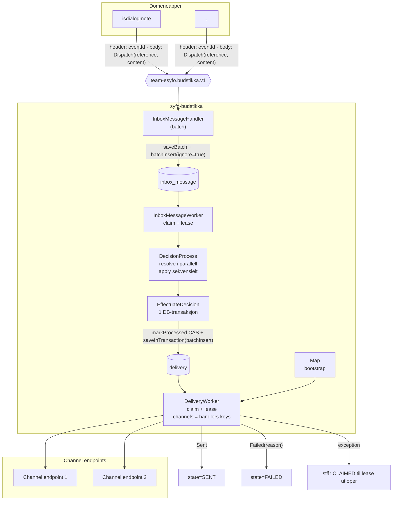

# Overordnet flyt — syfo-budstikka

Produsenter finner fasade, retry og versjonering i [sende-varsler.md](sende-varsler.md). Dette
dokumentet eier Budstikkas interne flyt.

## Flytoversikt

Budstikka er en tredelt pipeline: **Kafka-consumer → Inbox → Decision → Delivery**.

1. **InboxMessageHandler** (infrastructure/kafka/consumer/) — konsumerer, parser og lagrer meldingen i innboksen, eller legger den i dead letter ved feil.
2. **InboxMessageWorker** (application/) — ta eierskap til meldinger og kjører beslutningen
3. **DecisionProcess** (domain/decision/) — evaluerer reglene og produserer en Decision
4. **EffectuateDecision** (application/) — iverksetter beslutningen ved å opprette leveranser og markere innboksmeldingen som ferdig
5. **DeliveryWorker** (application/) — henter og sender videre til handler
6. **ChannelHandler** (application/) — sender til kanalendepunktet

```mermaid
flowchart TB
    subgraph Producers["Domeneapper"]
        P1["isdialogmote"]
        P2["..."]
    end

    P1 & P2 -->|"header: eventId · body: Dispatch(reference, content)"| TOPIC{{"team-esyfo.budstikka.v1"}}

    subgraph Budstikka["syfo-budstikka"]
        direction TB
        CONS["InboxMessageHandler<br/>(batch)"]
        INBOX[("inbox_message")]
        IWORK["InboxMessageWorker<br/>claim + lease"]
        DEC["DecisionProcess<br/>resolve i parallell<br/>apply sekvensielt"]
        EFF["EffectuateDecision<br/>1 DB-transaksjon"]
        OUTBOX[("delivery")]
        DWORK["DeliveryWorker<br/>claim + lease<br/>channels = handlers.keys"]
        MAP["Map<Channel, ChannelHandler><br/>bootstrap"]
    end

    TOPIC --> CONS
    CONS -->|"saveBatch + batchInsert(ignore=true)"| INBOX
    INBOX --> IWORK
    IWORK --> DEC --> EFF
    EFF -->|"markProcessed CAS + saveInTransaction(batchInsert)"| OUTBOX
    OUTBOX --> DWORK
    MAP --> DWORK

    DWORK -->|"Sent"| SENT["state=SENT"]
    DWORK -->|"Failed(reason)"| FAILED["state=FAILED"]
    DWORK -->|"exception"| RECLAIM["står CLAIMED til lease utløper"]

    subgraph Outbound["Channel endpoints"]
        CH1["Channel endpoint 1"]
        CH2["Channel endpoint 2"]
    end
    DWORK --> CH1
    DWORK --> CH2
```

## Claim, lease og transaksjonsgrenser

Claim/lease-algoritmen (ADR 0004), transaksjonsgrensene og alle
tilstandsoverganger eies av [datamodell.md](datamodell.md).

## Decision pattern (fetch, then decide)

`DecisionProcess` er delt i to steg:

1. **Fetch/resolve i parallell:** alle `DecisionRule.resolve(event)` kjøres med `async/awaitAll`.
2. **Decide/apply sekvensielt:** de resolverte reglene foldes i rekkefølge over deliveries.
   Første `Dropped`/`Failed` stopper resten (short-circuit).

Dette gir lavere latens på oppslag, men fortsatt forutsigbar regelrekkefølge i selve beslutningen.

## Kanal-mapping

Kanal velges og brukes i to ulike maps:

1. **DispatchContent → DeliveryDraft** (`DispatchDraftMapping`): setter `operation`, `channel` og
   `recipient` for hver meldingstype.
2. **Channel → ChannelHandler** (`Map<Channel, ChannelHandler>` i `WorkerModule`): bestemmer hvilken
   handler som faktisk kan levere claimed rader.

Delivery-claim filtrerer på `handlers.keys`, så workeren henter bare kanaler som er registrert i
map-et. Nye kanaler legges til ved å registrere en `ChannelHandler` i dette map-et.

## FERDIGSTILL-flyt

Hvordan budstikka lukker/inaktiverer et tidligere OPPRETT-varsel uten domenekunnskap
(ADR 0001). FERDIGSTILL er en **egen hendelse** på samme kontrakt og topic som OPPRETT,
og går gjennom **samme inbox/decision/delivery-flyt**. `*Inactivate`-hendelsene er fortsatt
tynne; konkret lukkeatferd avledes fra lagret CREATE-data.

### Targeting og matching

- Inactivate-hendelsene er bevisst **thin**: `reference` + typet nøkkel
  (`PersonIdentifier`/`Orgnummer`); kanal er implisitt i typen. Den typede nøkkelen
  bevarer PII-maskering og gjør ulovlige `(kanal, nøkkel)`-par urepresenterbare.
- Matching skjer på `(reference, channel, recipient)`:
  - `BrukervarselInactivate` → `BRUKERVARSEL + sykmeldt`
  - `LedervarselInactivate` → `LEDERVARSEL + sykmeldt`
  - `ArbeidsgivervarselInactivate` → `ARBEIDSGIVERVARSEL + orgnummer`
- Samme nøkkel brukes mot to lagringsflater:
  1. lagret CREATE i `delivery`
  2. ventende CREATE-rader i `inbox_message` som står i `WAIT`, eller er vekket til `CLAIMED`
     med `wait_reason`
- Resolvert NL-fnr deltar aldri i matching. For arbeidsgivervarsel deltar heller ikke Fager-id
  i matching; den brukes bare når en avledet lukking faktisk skal sendes.
- Vil en produsent lukke flere kanaler, sender den én FERDIGSTILL per kanal. Budstikka
  bestemmer aldri scope eller fan-out selv.

### Lukkeoperasjon avledes fra lagret rad

FERDIGSTILL-hendelsen bærer aldri meldingstype, mottakersti eller lukke-id. Runtime gjør i stedet:

1. låser den claimede FERDIGSTILL-raden i inbox
2. leser eventuell lagret CREATE fra `delivery`
3. låser alle matchende ventende CREATE-rader i inbox
4. leser CREATE fra `delivery` på nytt etter disse låsene
5. velger ett av utfallene under

Hvis lagret CREATE finnes, styres videre flyt av den persistente `delivery.state`:

- `SENT` → avled ordinær `delivery(operation=INACTIVATE)` fra lagret CREATE-payload
- `READY` / `CLAIMED` → legg FERDIGSTILL kort i teknisk `WAIT` og sjekk igjen senere
- `FAILED` → behandle FERDIGSTILL terminalt uten outbound close

Dermed kommer `tag`, objekt-type, mottakersti og andre tekniske attributter fra CREATE-raden
som faktisk ble materialisert, ikke fra den tynne FERDIGSTILL.

For arbeidsgivervarsel fryses den stabile Fager-id-en i `delivery.create_external_id` når CREATE
materialiseres. Den samme id-en bæres videre til den avledede INAKTIVER-leveransen, slik at
lukking ikke trenger noe nytt nærmeste-leder-oppslag eller annen rekonstruksjon.

### Kantsituasjoner

| Situasjon | Handling |
| --- | --- |
| Gyldig lagret CREATE i `SENT` | Skriv `delivery(operation=INAKTIVER)` avledet fra lagret rad |
| Matchende lagret CREATE i `READY` / `CLAIMED` | Sett FERDIGSTILL i teknisk `WAIT` (`AWAITING_MATCHING_CREATE_SENT`); ingen delivery ennå |
| Matchende lagret CREATE i `FAILED` | Inbox → `PROCESSED`, ingen delivery-rad, PII-fri logg + metrikk |
| Matchende CREATE fortsatt holdt i `WAIT`/vekket `CLAIMED` | Marker CREATE-radene `PROCESSED` direkte; ingen delivery materialiseres |
| Ingen matchende CREATE | Ikke hard feil: inbox → `PROCESSED`, ingen delivery-rad, PII-fri logg + metrikk |
| Runtime-kanalen støttes ikke | Ikke hard feil: inbox → `PROCESSED`, ingen delivery-rad, PII-fri logg + metrikk |
| Lagret CREATE er ugyldig | Ikke hard feil: inbox → `PROCESSED`, ingen delivery-rad, PII-fri logg + metrikk |

### Race med sendevindu-hold (ADR 0014)

Racet mellom FERDIGSTILL og en ventende CREATE serialiseres med radlåser. Bare to utfall er
gyldige:

1. **FERDIGSTILL vinner før CREATE materialiseres:** matchende `WAIT`-rader (eller vekkede
   `CLAIMED`-rader med `wait_reason`) markeres `PROCESSED` direkte, og ingen delivery opprettes.
2. **CREATE vinner først:** CREATE-raden finnes i `delivery` når FERDIGSTILL leser på nytt etter
   låsene, og en ordinær INAKTIVER-delivery avledes fra den lagrede raden. Eventuelle duplikate
   ventende CREATE-rader kanselleres fortsatt direkte. Hvis CREATE-raden ennå bare står i
   `READY`/`CLAIMED`, venter FERDIGSTILL kort til samme rad er bekreftet `SENT`.

Vanlige `RECEIVED`-rader og `CLAIMED`-rader uten `wait_reason` er ikke del av denne
kanselleringsflaten.

### Lukkbarhet per kanal

| Kanal                     | Kan lukkes? | Mekanisme (INAKTIVER) |
|---------------------------| --- | --- |
| Min side brukervarsel     | Ja | Publiser inaktiver-event avledet fra lagret CREATE |
| Dine Sykmeldte (NL)       | Ja | Ferdigstill-hendelse avledet fra lagret CREATE |
| Ditt Sykefravær           | Ikke i runtime | Terminal no-op; ingen outbound lukking |
| AG-notifikasjon (+Altinn) | Ja | Avledet fra lagret rad: `BESKJED` → `hardDeleteNotifikasjonByEksternId_V2`, `OPPGAVE` → `oppgaveUtfoertByEksternId_V2`. Fagers `NotifikasjonFinnesIkke` på disse V2-lukkingene behandles som transient og går ordinær lease-retry/poison-løype |
| Fysisk brev               | **Nei** | Kan ikke trekkes tilbake |
| Microfrontend             | Synlighet | «Lukking» = `disable` via eget enable/disable-par |

### Ugyldige kombinasjoner

- Ulovlige kombinasjoner (f.eks. FERDIGSTILL + BREV) gjøres **urepresenterbare** i
  den typede kontrakten (sealed types) → produsent får feil ved bygg/validering,
  ikke i drift.
- Runtime er **defense-in-depth**: skulle en unsupported kanal eller en ugyldig lagret CREATE
  likevel nå denne flyten, behandles FERDIGSTILL terminalt uten retry (`PROCESSED`, ingen
  delivery-rad, PII-fri logg/metrikk).

### Kafka-semantikk

Konsumenten skriver hendelsen til inbox og **committer offset umiddelbart**. All
validering/forretningslogikk skjer senere i beslutnings-workeren på DB-raden, frakoblet
Kafka. En terminal DB-status (`FAILED`/`DROPPED`/«ugyldig») **blokkerer aldri partisjonen**
og gir ingen redelivery-loop.
