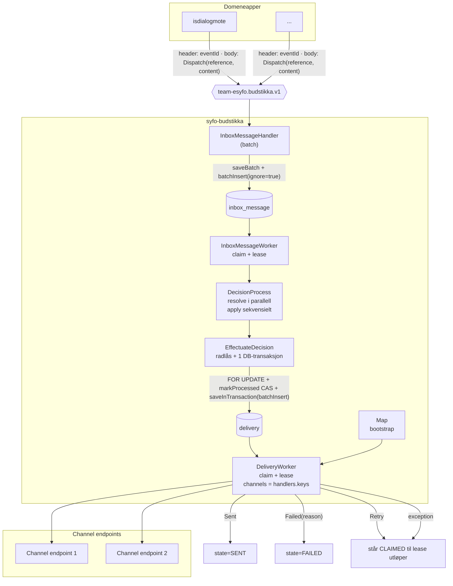

# Overordnet flyt — syfo-budstikka

Produsenter finner fasade, retry og versjonering i [sende-varsler.md](sende-varsler.md). Dette
dokumentet eier Budstikkas interne flyt.

## Flytoversikt

Budstikka er en tredelt pipeline: **Kafka-consumer → Inbox → Decision → Delivery**.

1. **InboxMessageHandler** (infrastructure/kafka/consumer/) — konsumerer, parser og lagrer meldingen i innboksen, eller legger den i dead letter ved feil.
2. **InboxMessageWorker** (application/) — ta eierskap til meldinger og kjører beslutningen
3. **DecisionProcess** (domain/decision/) — evaluerer reglene og produserer en Decision
4. **EffectuateDecision** (application/) — iverksetter beslutningen ved å opprette leveranser og markere innboksmeldingen som ferdig
5. **DeliveryWorker** (application/) — henter og sender videre til handler
6. **ChannelHandler** (application/) — sender til kanalendepunktet

```mermaid
flowchart TB
    subgraph Producers["Domeneapper"]
        P1["isdialogmote"]
        P2["..."]
    end

    P1 & P2 -->|"header: eventId · body: Dispatch(reference, content)"| TOPIC{{"team-esyfo.budstikka.v1"}}

    subgraph Budstikka["syfo-budstikka"]
        direction TB
        CONS["InboxMessageHandler<br/>(batch)"]
        INBOX[("inbox_message")]
        IWORK["InboxMessageWorker<br/>claim + lease"]
        DEC["DecisionProcess<br/>resolve i parallell<br/>apply sekvensielt"]
        EFF["EffectuateDecision<br/>radlås + 1 DB-transaksjon"]
        OUTBOX[("delivery")]
        DWORK["DeliveryWorker<br/>claim + lease<br/>channels = handlers.keys"]
        MAP["Map<Channel, ChannelHandler><br/>bootstrap"]
    end

    TOPIC --> CONS
    CONS -->|"saveBatch + batchInsert(ignore=true)"| INBOX
    INBOX --> IWORK
    IWORK --> DEC --> EFF
    EFF -->|"FOR UPDATE + markProcessed CAS + saveInTransaction(batchInsert)"| OUTBOX
    OUTBOX --> DWORK
    MAP --> DWORK

    DWORK -->|"Sent"| SENT["state=SENT"]
    DWORK -->|"Failed(reason)"| FAILED["state=FAILED"]
    DWORK -->|"Retry"| RECLAIM["står CLAIMED til lease utløper"]
    DWORK -->|"exception"| RECLAIM

    subgraph Outbound["Channel endpoints"]
        CH1["Channel endpoint 1"]
        CH2["Channel endpoint 2"]
    end
    DWORK --> CH1
    DWORK --> CH2
```

## Claim, lease og transaksjonsgrenser

Claim/lease-algoritmen (ADR 0004), transaksjonsgrensene og alle
tilstandsoverganger eies av [datamodell.md](datamodell.md).

## Decision pattern (fetch, then decide)

`DecisionProcess` er delt i to steg:

1. **Fetch/resolve i parallell:** alle `DecisionRule.resolve(event)` kjøres med `async/awaitAll`.
2. **Decide/apply sekvensielt:** de resolverte reglene foldes i rekkefølge over deliveries.
   Første `Dropped`/`Failed` stopper resten (short-circuit).

Dette gir lavere latens på oppslag, men fortsatt forutsigbar regelrekkefølge i selve beslutningen.

## Kanal-mapping

Kanal velges og brukes i to ulike maps:

1. **DispatchContent → DeliveryDraft** (`DispatchDraftMapping`): setter `operation`, `channel` og
   `recipient` for hver meldingstype.
2. **Channel → ChannelHandler** (`Map<Channel, ChannelHandler>` i `WorkerModule`): bestemmer hvilken
   handler som faktisk kan levere claimed rader.

Delivery-claim filtrerer på `handlers.keys`, så workeren henter bare kanaler som er registrert i
map-et. Nye kanaler legges til ved å registrere en `ChannelHandler` i dette map-et.

## FERDIGSTILL-flyt

Hvordan budstikka lukker/inaktiverer et tidligere sendt varsel, uten domenekunnskap
(ADR 0001). FERDIGSTILL er en **egen hendelse** på samme kontrakt og topic som OPPRETT,
og går gjennom **samme flyt og samme delivery-maskineri**. En lukking er bare en
`delivery`-rad med `operation=INAKTIVER` — den plukkes via claim/lease og er idempotent
(egen `delivery.id`) på lik linje med en utsending.

### Targeting og matching

- Inactivate-hendelsene er bevisst **thin**: `reference` + typet nøkkel
  (`PersonIdentifier`/`Orgnummer`); kanal er implisitt i typen. Den typede nøkkelen
  bevarer PII-maskering og gjør ulovlige `(kanal, nøkkel)`-par urepresenterbare.
- Matching: budstikka slår opp alle lagrede OPPRETT-leveranser på `(reference, recipient_id, kanal)`,
  der `recipient_id` = OPPRETTs partisjonsanker (id-en konsumenten kjenner ved create):
  sykmeldt-fnr for BRUKERVARSEL/LEDERVARSEL/DITT_SYKEFRAVAER (sykmeldt, ikke NL-fnr),
  orgnr for ARBEIDSGIVERVARSEL. Resolvert NL-fnr / `ekstern_respons_id` bor i payload/egne
  kolonner og deltar aldri i matching.
- Vil en produsent lukke flere kanaler, sender den én FERDIGSTILL per kanal. Budstikka
  bestemmer aldri scope eller fan-out selv.

### Lukkeoperasjon avledes fra lagret rad

FERDIGSTILL-hendelsen bærer aldri meldingstype, sti eller operation. Runtime slår først opp alle
matchende lagrede OPPRETT-leveranser og lager én ordinær `delivery(operation=INAKTIVER)` per
gyldig CREATE. Hver dependent peker med `source_create_delivery_id` til sin eksakte source CREATE.
For BRUKERVARSEL og LEDERVARSEL er den thin INAKTIVER-payloaden avledet fra create-raden. For
ARBEIDSGIVERVARSEL beholdes create-payloaden som frosset lukkegrunnlag, sammen med den stabile
create-eksternId-en. Kanalhandleren bruker bare disse lagrede dataene ved lukking, aldri et nytt
Nærmeste leder-oppslag.
En manglende eller historisk uavklart eksternId er en terminal feil uten publiserings- eller
lukke-kall. Under kompatibilitetsmigreringen avstemmes bare ventende avhengige leveranser gjennom
`source_create_delivery_id`; `SENT` og `FAILED` endres ikke. Lukking forblir deaktivert til
kompatibel kode er utrullet og gamle replikaer og arbeidere med pågående behandling er stoppet.
Denne sperren omfatter også gamle inbox-skrivere: alle som skriver til inbox må delta i
referanselåsingen, mens eldre `saveBatch`-implementasjoner omgår den.
Uavklarte identiteter krever separat autorisert avstemming før lukking aktiveres for de berørte
dataene; ikke rull tilbake til reservehandlere mens uavklarte rader eller lukkinger i kø finnes.

En dependent kan først claimes når sin source CREATE er `SENT`; en `FAILED` source terminaliserer
dependent som `FAILED` uten handlerkall eller nytt forsøk. En PostgreSQL session advisory lock
serialiserer dispatch av source CREATE og dens dependents per source på tvers av replikaer, og
holdes gjennom eksternt handlerkall og terminal state-overgang.
Guarden gir ikke en distribuert transaksjon: stabile nedstrøms-ID-er, idempotens og avstemming er
fortsatt nødvendige, i tråd med [ADR 0017](adr/0017-kilde-create-lases-ved-avhengig-inactivate.md).

For FERDIGSTILL med `Decision.Processed` tar runtime først referanselåsen og deretter låsen på
egen claimede inbox-rad. Hvis raden ikke lenger er `CLAIMED`, returneres `Skipped` uten
delivery- eller kandidatsøk, tilstandsendringer eller nye leveranser. Først etter vunnet claim
gjør runtime første delivery-oppslag og låser deretter alltid **alle** matchende, ennå ikke
materialiserte OPPRETT-er i `RECEIVED`, `WAIT` eller `CLAIMED`, også når oppslaget allerede fant
en delivery. SQL avgrenser på den lagrede CREATE-discriminatoren før `FOR UPDATE`, slik at
FERDIGSTILL-rader aldri låses som kandidater. Etter låsene leses delivery på nytt: vant
opprettelsen, avledes vanlig INAKTIVER; alle låste OPPRETT-er markeres samtidig `PROCESSED` uten å
materialisere. Ellers markeres de låste OPPRETT-ene og FERDIGSTILL `PROCESSED` uten delivery.
Opprettelsen låser også sin egen inbox-rad før terminal overgang og delivery-write, slik at bare
én av disse to utfallene kan vinne.

Referanselåsen beskrevet i [datamodell.md](datamodell.md#transaksjonsgrenser) avgrenser hvilke
innsettinger kanselleringen omfatter. OPPRETT-er som settes inn før kanselleringen får låsen,
blir synlige for kandidatsøket og kanselleres hvis de matcher og ennå ikke er materialisert.
En innsetting som venter til kanselleringen committer, regnes derimot som en senere ankomst
og kan behandles normalt. FERDIGSTILL etterlater ingen permanent kanselleringsmarkør eller
sperre mot fremtidige OPPRETT-er.

### Kantsituasjoner

| Situasjon | Handling |
| --- | --- |
| Én eller flere OPPRETT-deliveries funnet | Skriv én `delivery(operation=INAKTIVER)` per gyldig CREATE → outbox lukker på kanalen; hver dependent peker til sin eksakte source. Ugyldige eller `FAILED` søsken undertrykker ikke gyldige closes. Alle matchende, ikke-materialiserte OPPRETT-er i `RECEIVED`, `WAIT` eller `CLAIMED` kanselleres samtidig |
| Én eller flere matchende OPPRETT-er fortsatt i inbox | Lås alle CREATE-radene i `RECEIVED`, `WAIT` eller `CLAIMED` og avslutt hver OPPRETT direkte som `PROCESSED`; ingen delivery og ingen egen `CANCELLED`-state |
| Ingen matchende OPPRETT | Ikke hard feil: inbox → `PROCESSED`, ingen delivery-rad, logg + metrikk `ferdigstill_uten_treff`. Når en matching OPPRETT ennå finnes i inbox, låses den og kanselleres før FERDIGSTILL terminaliseres. Kafka-partisjonsrekkefølge garanterer ikke workernes tidsrekkefølge på tvers av replikaer. |
| Lagret OPPRETT har ugyldig payload-/kanal-/mottaker-kombinasjon | FERDIGSTILL og alle låste hold-kopier blir `PROCESSED` uten delivery, med PII-fri logg + metrikk `ferdigstill_lagret_opprett_ugyldig`; dette er ikke en manglende runtime-kanal eller en manglende match. |

### Lukkbarhet per kanal

| Kanal                     | Kan lukkes? | Mekanisme (INAKTIVER) |
|---------------------------| --- | --- |
| Min side brukervarsel     | Ja | Publiser inaktiver-event (tms varsel, samme `reference` som `varselId`) |
| Dine Sykmeldte (NL)       | Ja | Ferdigstill-hendelse på dinesykmeldte-topic |
| Ditt Sykefravær           | **Nei, ikke i dette snittet** | Downstream-adapter og godkjent kontrakt mangler; FERDIGSTILL blir terminal no-op |
| AG-notifikasjon (+Altinn) | Ja | Avledet fra lagret CREATE: BESKJED→`hardDeleteNotifikasjonByEksternId_V2`, OPPGAVE→`oppgaveUtfoertByEksternId_V2`; stabil eksternId kommer fra CREATE-handleren. Fagers `NotifikasjonFinnesIkke` fra en lukking prøves på nytt av den ordinære delivery-mekanikken. Forsøket bruker det konfigurerte attempt-budsjettet; når dette er brukt opp, blir raden `FAILED` gjennom poison-gaten. Nye forsøk avbryter ikke resten av delivery-batchen. |
| Fysisk brev               | **Nei** | Kan ikke trekkes tilbake |
| Microfrontend             | Synlighet | «Lukking» = `disable` via eget enable/disable-par |

### Ikke-støttet runtime-kanal

- Ulovlige kombinasjoner (f.eks. FERDIGSTILL + BREV) gjøres **urepresenterbare** i
  den typede kontrakten (sealed types) → produsent får feil ved bygg/validering,
  ikke i drift.
- DITT_SYKEFRAVAER er den eneste representerbare FERDIGSTILL-varianten uten støttet
  runtime-kanal i dette snittet. Den blir `PROCESSED` uten delivery-rad, med PII-fri logg og
  metrikk `ferdigstill_uten_runtime_kanal`. Ingen alert-storm, ingen `FAILED`.

Dette er et første snitt av #26. Ditt Sykefravær er uttrykkelig ikke ende-til-ende implementert
og blokkerer full ferdigstillelse av issue #26.

### Kafka-semantikk

Konsumenten skriver hendelsen til inbox og **committer offset umiddelbart**. All
validering/forretningslogikk skjer senere i beslutnings-workeren på DB-raden, frakoblet
Kafka. En terminal DB-status (`FAILED`/`DROPPED`/no-op) **blokkerer aldri partisjonen**
og gir ingen redelivery-loop.
